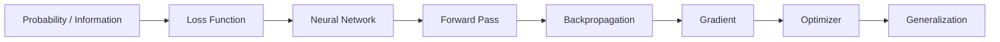

# ML / DL 筆記地圖

## 建議理解順序

## 1. Foundations

- [[Note/Research/01 - Entropy and Information|Entropy and Information]]
- [[Note/Research/02 - Likelihood NLL and Cross-Entropy|Likelihood, NLL and Cross-Entropy]]
- [[Note/Research/03 - MAE and MSE|MAE and MSE]]
- [[Note/Research/04 - Softmax|Softmax]]
- [[Note/Research/05 - Feature Normalization|Feature Normalization]]

## 2. Neural Networks

- [[Note/Research/01 - Neuron Features and Parameters|Neuron, Features and Parameters]]
- [[Note/Research/02 - Hidden Layers and Multiple Features|Hidden Layers and Multiple Features]]
- [[Note/Research/03 - Activation Functions|Sigmoid and ReLU]]
- [[Note/Research/04 - Batch Normalization|Batch Normalization]]

## 3. Optimization Basics

- [[Note/Research/01 - Gradient Descent and Learning Rate|Gradient Descent and Learning Rate]]
- [[Note/Research/02 - Local Minima Saddle Points and Critical Points|Local Minima, Saddle Points and Critical Points]]
- [[Note/Research/03 - Taylor Expansion Hessian and Eigenvalues|Taylor Expansion, Hessian and Eigenvalues]]
- [[Note/Research/04 - Batch Mini-batch and Batch Size|Batch / Mini-batch / Batch Size]]
- [[Note/Research/05 - Learning Rate Scheduling and Warm-up|Learning Rate Scheduling and Warm-up]]

## 4. Optimizers

- [[Note/Research/01 - Momentum|Momentum]]
- [[Note/Research/02 - RMSProp|RMSProp]]
- [[Note/Research/03 - Adam|Adam]]
- [[Note/Research/04 - Optimizer Comparison|Optimizer Comparison]]
- [[Note/Research/05 - AdaGrad and Gradient Scaling|AdaGrad and Gradient Scaling]]

## 5. Backpropagation

- [[Note/Research/01 - Chain Rule and Total Derivative|Chain Rule and Total Derivative]]
- [[Note/Research/02 - Computational Graph and Backpropagation|Computational Graph and Backpropagation]]
- [[Note/Research/03 - Gradient Accumulation Across a Batch|Gradient Accumulation Across a Batch]]
- [[Note/Research/04 - Differentials Gradients and Jacobians|Differentials Gradients and Jacobians]]

## 6. Generalization

- [[Note/Research/01 - Train Validation and Test Sets|Train / Validation / Test]]
- [[Note/Research/02 - K-Fold Cross Validation|K-Fold Cross Validation]]
- [[Note/Research/03 - Underfitting Overfitting and Model Bias|Underfitting / Overfitting / Model Bias]]
- [[Note/Research/04 - Model Complexity Data Augmentation and Optimization Failure|Model Complexity / Data Augmentation / Optimization Failure]]

> [!important]
> 原手寫稿中「Model Bias」主要是在說模型表達能力太弱造成的 underfitting。這裡的 bias 是 statistical/model bias，不是 AI fairness 裡的社會偏見。

## 來源與導覽

- [[00_Dashboard/AI Overview|AI Overview]]
- [[Assets/Note/Research/ML_DL_Obsidian_Notes.zip|原始筆記 ZIP]]
- [[Note/Research/99 - Figure Sources|圖片來源與授權]]
