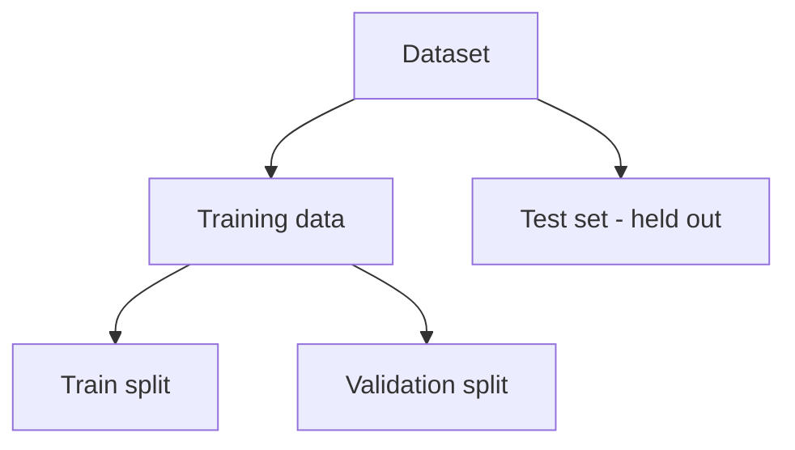

# Train, Validation and Test Sets

## Training set

用來直接更新 parameters：

$$
\theta\leftarrow \operatorname{Optimizer}(\theta,\nabla\mathcal L_{train})
$$

## Validation set

不拿來做 gradient update，而是用來：

- 選 hyperparameters
- 選 model architecture
- early stopping
- 比較不同 checkpoints

## Test set

最後才使用，用來估計模型對未見資料的 generalization performance。

> [!important]
> 如果一直根據 test result 改模型，test set 實際上就被你當成 validation set 使用，最後的 performance estimate 會偏樂觀。

## Public / Private Test

在 Kaggle 類 competition 裡常有：

- Public leaderboard subset
- Private leaderboard subset

這是 competition-specific 的 test design，不是一般 ML pipeline 必備結構。

## Related

- [[Note/Research/ML_DL_Obsidian_Notes/02 - K-Fold Cross Validation|02 - K-Fold Cross Validation]]
- [[Note/Research/ML_DL_Obsidian_Notes/03 - Underfitting Overfitting and Model Bias|03 - Underfitting Overfitting and Model Bias]]
