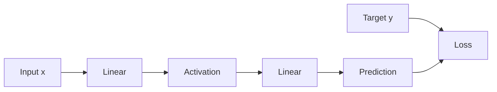

# Computational Graph and Backpropagation

Backpropagation 的目的：

$$
\boxed{
\text{efficiently compute }\frac{\partial\mathcal L}{\partial\theta_i}
\text{ for all parameters}
}
$$

Source: https://commons.wikimedia.org/wiki/File:Back_Propagation_Example.svg

## Forward pass

先由 input 算到 prediction 和 loss：

Forward pass 會保存 intermediate values，因為 backward 時會用到。

## Backward pass

從 loss 往回傳 gradient：

$$
\frac{\partial\mathcal L}{\partial\theta}
=
\frac{\partial\mathcal L}{\partial y}
\frac{\partial y}{\partial\theta}
$$

例如：

$$
y=x_1w_1+x_2w_2+b
$$

則：

$$
\frac{\partial y}{\partial w_1}=x_1,
\qquad
\frac{\partial y}{\partial w_2}=x_2,
\qquad
\frac{\partial y}{\partial b}=1
$$

如果 $a=\sigma(z)$：

$$
\frac{\partial\mathcal L}{\partial z}
=
\frac{\partial\mathcal L}{\partial a}\sigma'(z)
$$

## 為什麼 backprop 高效？

不是對每一個 parameter 都重新從頭求 derivative，而是：

1. Forward 一次算出中間結果。
2. Backward 從 output gradient 開始。
3. 每個 node 使用 local derivative。
4. 重複利用已算過的 upstream gradient。

這本質上是 reverse-mode automatic differentiation。

## 計算例子

用單一 ReLU 神經元：$z=wx+b$、$a=\max(0,z)$、$\mathcal L=\tfrac12(a-y)^2$。設 $x=2$、$w=1$、$b=0$、目標 $y=1$。

前向計算：

$$
z=1(2)+0=2,\qquad a=2,\qquad\mathcal L=\tfrac12(2-1)^2=0.5
$$

反向計算，由於 $z>0$，ReLU 的導數為 1：

$$
\frac{\partial\mathcal L}{\partial a}=a-y=1,
\qquad\frac{\partial\mathcal L}{\partial z}=1\times1=1
$$

$$
\frac{\partial\mathcal L}{\partial w}=1\times x=2,
\qquad\frac{\partial\mathcal L}{\partial b}=1
$$

以 $\eta=0.1$ 同時更新：$w'=0.8$、$b'=-0.1$。再次前向計算得到 $z'=0.8(2)-0.1=1.5$，新 loss 為 $\tfrac12(1.5-1)^2=0.125$。

## Related

- [[Note/Research/ML_DL_Obsidian_Notes/01 - Chain Rule and Total Derivative|01 - Chain Rule and Total Derivative]]
- [[Note/Research/ML_DL_Obsidian_Notes/03 - Gradient Accumulation Across a Batch|03 - Gradient Accumulation Across a Batch]]
- [[Note/Research/ML_DL_Obsidian_Notes/01 - Gradient Descent and Learning Rate|Gradient Descent]]
