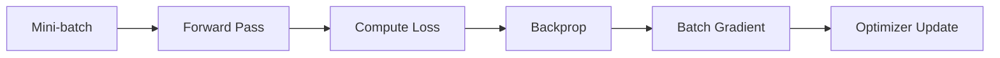

# Gradient Accumulation Across a Batch

如果 batch 裡有 $B$ 筆資料，average loss：

$$
\mathcal L_B(\theta)
=
\frac1B\sum_{n=1}^{B}\mathcal L_n(\theta)
$$

利用 derivative 的線性性：

$$
\boxed{
\nabla_\theta\mathcal L_B
=
\frac1B\sum_{n=1}^{B}\nabla_\theta\mathcal L_n
}
$$

所以每一筆資料都對 parameter gradient 有貢獻，batch gradient 是這些 contribution 的平均（或某些實作採 sum，再由其他地方做 scaling）。

## 訓練流程

這與手寫稿「把 $N$ 筆資料分 batch，每個 batch 更新 parameters」是同一件事。

## 計算例子

設 $\hat y=wx$、單筆 loss 為 $\mathcal L_n=\tfrac12(wx_n-y_n)^2$，則 $\partial\mathcal L_n/\partial w=(wx_n-y_n)x_n$。

在同一個 $w=1$ 下，兩筆樣本為 $(x_1,y_1)=(1,0)$、$(x_2,y_2)=(2,0)$：

$$
g_1=(1\times1-0)1=1,\qquad g_2=(1\times2-0)2=4
$$

$$
\mathcal L_B=\frac{0.5+2}{2}=1.25,
\qquad g_B=\frac{1+4}{2}=2.5
$$

以 $\eta=0.1$ 更新一次，$w'=1-0.1(2.5)=0.75$。若拆成兩個 micro-batch 累積，應各累積 $g_n/2$，完成後才更新；直接相加會得到 $5$，使這次更新量加倍。

## Related

- [[Note/Research/ML_DL_Obsidian_Notes/04 - Batch Mini-batch and Batch Size|Batch Size]]
- [[Note/Research/ML_DL_Obsidian_Notes/02 - Computational Graph and Backpropagation|02 - Computational Graph and Backpropagation]]
