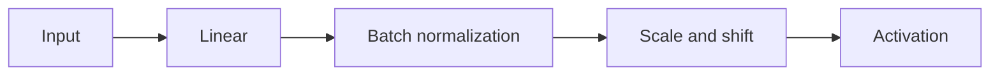

# Batch Normalization

BatchNorm（BN）在模型中對特徵標準化，再以可學習的 $\gamma,\beta$ 調整尺度與位置。同一批樣本使用同一組模型權重；對同一個神經元輸出的數值跨樣本計算統計量，不是每筆資料各自換一組權重。

## 訓練時的運算

對同一特徵的 $B$ 個值 $z^{(1)},\ldots,z^{(B)}$：

$$
\mu_B=\frac1B\sum_{n=1}^B z^{(n)},\qquad
\sigma_B^2=\frac1B\sum_{n=1}^B(z^{(n)}-\mu_B)^2
$$

$$
\tilde z^{(n)}=\frac{z^{(n)}-\mu_B}{\sqrt{\sigma_B^2+\epsilon}},\qquad
u^{(n)}=\gamma\tilde z^{(n)}+\beta
$$

$\sigma_B^2$ 是變異數，$\sigma_B$ 才是標準差。手寫稿若先用 $\sigma$ 表示標準差，分母不能再寫成 $\sqrt{\sigma+\epsilon}$。$\epsilon>0$ 避免分母為零；加入它後，標準化值的變異數為 $\sigma_B^2/(\sigma_B^2+\epsilon)$，通常接近 1，但不必恰為 1。

全連接層常對每個特徵分別計算；卷積 BN 通常對每個 channel 跨 batch 與空間位置計算。$\gamma,\beta$ 也按特徵或 channel 學習。向量形式 $\mathbf u=\boldsymbol\gamma\odot\tilde{\mathbf z}+\boldsymbol\beta$ 中，$\odot$ 是逐元素相乘。

這是常見放置方式，實際順序依架構而定。原論文展示 BN 可改善訓練效率並容許較大的 learning rate，但不代表任意大步長都穩定。[原論文](https://arxiv.org/abs/1502.03167)

## 三筆資料的完整計算

取 $z=(2,4,6)$，則 $\mu_B=4$、$\sigma_B^2=8/3$。以下近似忽略極小的 $\epsilon$：

$$
\tilde z\approx(-1.2247,0,1.2247)
$$

令 $\gamma=2$、$\beta=3$：

$$
u=2\tilde z+3\approx(0.5505,3,5.4495)
$$

若先把 $\tilde z$ 四捨五入成 $(-1.22,0,1.22)$，就會得到手寫稿的 $(0.56,3,5.44)$。$\beta$ 控制平移；$|\gamma|$ 控制尺度，負的 $\gamma$ 也會反轉大小順序。忽略 $\epsilon$ 時，本例輸出平均為 3、標準差為 2。

## 推論時與 moving average

通常在訓練期間維護 running mean 與 running variance，推論時固定使用它們。原因是要讓統計量固定，並非測試不能分 batch。

用 $\rho$ 表示舊值的保留比例：

$$
\bar\mu_t=\rho\bar\mu_{t-1}+(1-\rho)\mu_{B,t}
$$

例如 $\rho=0.9$、舊平均 $2$、本批平均 $4$，更新後是 $0.9(2)+0.1(4)=2.2$。變異數也維護 running estimate。

推論公式為 $u=\gamma(z-\bar\mu)/\sqrt{\bar v+\epsilon}+\beta$。例如固定 $\bar\mu=4,\bar v=4,\gamma=2,\beta=3$，輸入 $z=6$ 時，忽略 $\epsilon$ 得到 $u=5$。

PyTorch 的 `momentum` 是新統計量權重，即此處的 $1-\rho$；訓練前向變異數使用除以 $B$，running variance 更新使用不偏估計。若 `track_running_stats=False`，評估時仍用 batch 統計量。[BatchNorm1d 文件](https://docs.pytorch.org/docs/2.14/generated/torch.nn.BatchNorm1d.html)

## Related

[[Note/Research/ML_DL_Obsidian_Notes/05 - Feature Normalization|05 - Feature Normalization]]
[[Note/Research/ML_DL_Obsidian_Notes/03 - Gradient Accumulation Across a Batch|03 - Gradient Accumulation Across a Batch]]

## 手寫原稿

> [!note]- 照片 1：手寫原稿
> ![[Assets/Note/Research/ML_DL_Obsidian_Notes/Photo 1.jpg|700]]

> [!note]- 照片 2：手寫原稿
> ![[Assets/Note/Research/ML_DL_Obsidian_Notes/Photo 2.jpg|700]]

> [!note]- 照片 3：手寫原稿
> ![[Assets/Note/Research/ML_DL_Obsidian_Notes/Photo 3.jpg|700]]
