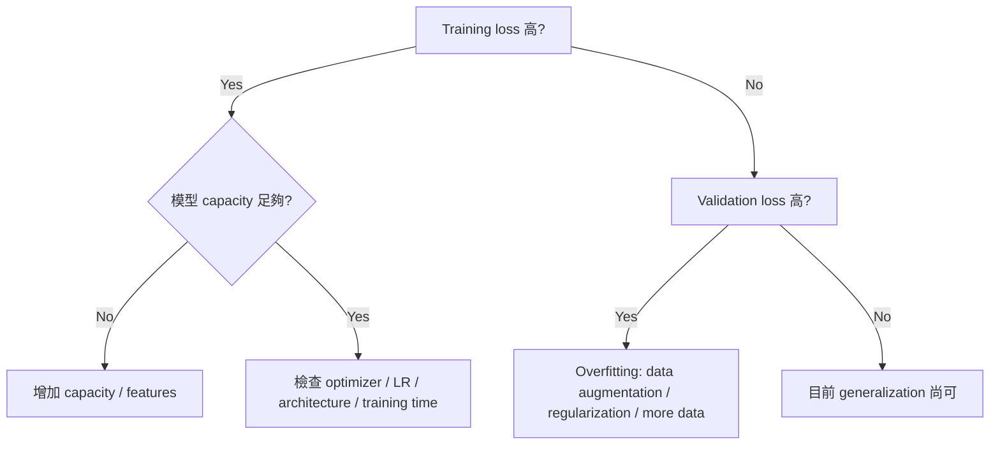

# Model Complexity, Data Augmentation and Optimization Failure

## Training loss 很高時

先問：模型是不是根本沒把 training data 學好？

可能是：

1. Model capacity 太低 → underfitting / high bias
2. Optimizer / learning rate 不適合
3. Architecture 很難 optimize
4. 訓練時間不夠

## Training loss 低，但 validation/test loss 高

比較接近 overfitting。

常見處理方式：

- 更多 training data
- data augmentation
- regularization
- 降低不必要的 model capacity
- early stopping

## 深度增加但 training error 反而更差

手寫稿提到類似：更深的 model（例如 56-layer）training error 反而高於較淺 model。

這種情況**不能直接叫 overfitting**，因為 overfitting 的典型現象是 training error 很低、test error 高。

如果更深網路連 training set 都學不好，更像：

$$
\boxed{\text{optimization / architecture degradation problem}}
$$

也就是「模型理論上 capacity 更大，但實際上不好訓練」。

## 簡化診斷流程

## Related

- [[Note/Research/ML_DL_Obsidian_Notes/03 - Underfitting Overfitting and Model Bias|03 - Underfitting Overfitting and Model Bias]]
- [[Note/Research/ML_DL_Obsidian_Notes/01 - Gradient Descent and Learning Rate|Gradient Descent]]
