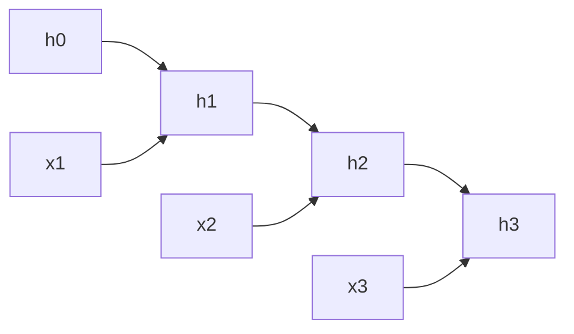

# Recurrent Neural Network (RNN)

來源：手寫 RNN 筆記。RNN 依序讀入資料，將前一個時間步的 hidden state 與目前輸入結合，形成新的 hidden state。

## 遞迴更新與共享權重

以 vanilla tanh RNN 為例：

$$
z_t=W_xx_t+W_hh_{t-1}+b_h,\qquad h_t=\tanh(z_t)
$$

$x_t$ 是目前輸入，$h_{t-1}$ 是前一步狀態。不同時間步共用同一組 $W_x,W_h,b_h$；不是每讀一個 token 就換一組權重。

若 $x_t\in\mathbb R^{d_x}$、$h_t\in\mathbb R^{d_h}$，則 $W_x\in\mathbb R^{d_h\times d_x}$、$W_h\in\mathbb R^{d_h\times d_h}$、$b_h\in\mathbb R^{d_h}$。初始狀態 $h_0$ 常設為零。

例如句子中的後面位置，要使用前面詞語的資訊，就須透過連續更新的 hidden state 傳遞。它提供歷史資訊，但不保證完整保存所有早期輸入。

## 手寫的兩步計算：線性簡化版

照片下半部省略 tanh 與 bias，使用 $h_t=W_xx_t+W_hh_{t-1}$。設 $W_x=0.5,W_h=0.8,h_0=0,x_1=2,x_2=1$：

$$
h_1=0.5(2)+0.8(0)=1
$$

$$
h_2=0.5(1)+0.8(1)=1.3
$$

這組 $1,1.3$ 是線性簡化版的結果，不能直接當成上方 tanh RNN 的輸出。

若保留 tanh，其他設定相同：

$$
h_1=\tanh(1)\approx0.761594
$$

$$
z_2=0.5+0.8(0.761594)\approx1.109275,\qquad
h_2=\tanh(z_2)\approx0.803806
$$

第二步必須使用真正的 $h_1=0.761594$，不能使用線性版的 $h_1=1$。

## 反向傳播：Backpropagation Through Time

將 RNN 沿時間展開後，使用 chain rule 計算梯度，稱為 BPTT。若最後一步有 loss，梯度會沿 $h_T\rightarrow h_{T-1}\rightarrow\cdots$ 往前傳。

$$
\frac{\partial h_t}{\partial h_{t-1}}
=\operatorname{diag}(1-h_t^2)W_h
$$

長距離梯度需要連乘多個這樣的 Jacobian。這些乘積可能變小，也可能變大；因此 RNN 可能發生 gradient vanishing 或 exploding，不是反向傳播一定越傳越小。

### 衰減的數字

在線性純量例子中，跨 $k$ 步的狀態導數為：

$$
\frac{\partial h_t}{\partial h_{t-k}}=0.8^k
$$

跨 10 步約為 $0.107374$，跨 50 步約為 $0.00001427$。若線性遞迴係數改成 $1.2$，跨 10 步則為 $1.2^{10}\approx6.1917$。一般向量 RNN 還取決於矩陣與活化函數導數，不能只看單一權重值。

在 tanh 版本中，若 $|h_t|$ 接近 1，$1-h_t^2$ 接近 0，還會進一步縮小沿該路徑的梯度。

### 共享權重的梯度也要相加

沿用線性兩步例子，令 $\mathcal L=\tfrac12(h_2-y)^2$、$y=0$。因為：

$$
h_2=W_xx_2+W_hW_xx_1+W_h^2h_0
$$

所以：

$$
\frac{\partial h_2}{\partial W_x}=x_2+W_hx_1=1+0.8(2)=2.6
$$

$$
\frac{\partial\mathcal L}{\partial W_x}=(h_2-y)(2.6)=1.3(2.6)=3.38
$$

只算第二步的直接貢獻會得到 $1.3x_2=1.3$，漏掉第一步經由 $h_1$ 傳來的梯度。這就是共享參數在不同時間步的貢獻需要相加的例子。

## 與 Transformer 的連結

單向 RNN 的 $h_t$ 依賴 $h_{t-1}$，同一序列的狀態計算有先後依賴。Self-attention 則可直接建立位置間的連結；causal Transformer 訓練時可以平行處理已知輸入位置，但自回歸生成仍需逐步產生新 token。

[[Attention Is All You Need]]
[[Note/Research/ML_DL_Obsidian_Notes/01 - Chain Rule and Total Derivative|Chain Rule 與路徑梯度相加]]
[[Note/Research/ML_DL_Obsidian_Notes/02 - Computational Graph and Backpropagation|Computational Graph 與 Backpropagation]]

## 手寫原稿

> [!note]- 照片 1：手寫原稿
> ![[Assets/Note/Research/Recurrent Neural Network (RNN)/Photo 1.jpg|800]]
