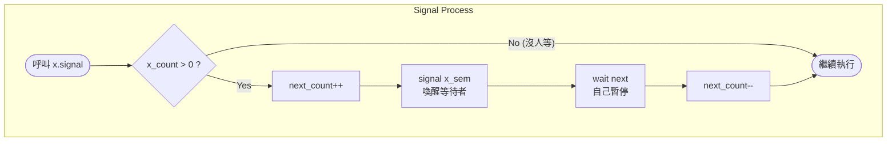

# 同步原語互轉實作 (Semaphore $\Leftrightarrow$ Monitor)

> [!SUMMARY] 筆記摘要
> 本筆記整理 **Semaphore (號誌)** 與 **Monitor (監視器)** 的雙向轉換實作，證明兩者在同步能力上的**等價性**。
> 1. **Sem $\to$ Mon**：作業系統理論重點 (Hoare-style)，需精密控制排隊與優先權。
> 2. **Mon $\to$ Sem**：現代程式實務 (Mesa-style)，利用高階鎖實作計數器。

---

## Part 1. 低階轉高階：用 Semaphore 實作 Monitor

> [!INFO] 場景設定
> 假設 OS 核心只提供 Semaphore，我們需要手動建構出一個支援 **Condition Variable** 的 monitor。
> - **機制**：**Hoare-style (Signal-and-Wait)**。
> - **特點**：發訊號者 (Signaler) 暫停，讓被喚醒者 (Signalee) 立即執行。

### 1. 變數宣告 (The Monitor Structure)
我們需要一組全域 Semaphore 來模擬 Monitor 的「大門」與「緊急暫停區」。

| 變數名稱 | 類型 | 初始值 | 用途說明 |
| :--- | :--- | :--- | :--- |
| **$mutex$** | `sem` | **1** | **大門鎖**：確保 Monitor 的互斥性 (Mutual Exclusion)。 |
| **$next$** | `sem` | **0** | **緊急暫停區**：當行程 `signal()` 別人時，自己需在此暫停。 |
| **$next\_count$** | `int` | 0 | 記錄目前卡在 $next$ 上的人數。 |
| **$x\_sem$** | `sem` | **0** | **條件排隊區**：行程呼叫 `x.wait()` 時在此卡住。 |
| **$x\_count$** | `int` | 0 | 記錄目前卡在 $x\_sem$ 上的人數。 |

### 2. 外部程序控制 (Entry & Exit Protocol)
為了確保互斥，任何外部函式 $F$ 的前後都必須加上控制碼。

```cpp
// 【進入 Monitor】
wait(mutex);         

// ... 函式 F 的主體內容 ...

// 【離開 Monitor】
// 優先檢查：有沒有人因為發 signal 而暫停在 next？
if (next_count > 0)
    signal(next);    // 有的話，接力棒交給他 (優先於門外排隊的人)
else
    signal(mutex);   // 沒有的話，才開大門
```

### 3. 條件變數操作 (Condition Variables)

#### A. `x.wait()` 的實作
邏輯：釋放目前的鎖 $\to$ 進入睡眠 $\to$ 醒來後恢復執行。

```cpp
x_count++;           // 1. 登記：我要去睡了
// 2. 釋放鎖 (邏輯同「離開 Monitor」)
if (next_count > 0)
    signal(next);
else
    signal(mutex);

wait(x_sem);         // 3. 【睡眠】卡在這裡，直到被 signal
x_count--;           // 4. 醒來了，撤銷登記
```

#### B. `x.signal()` 的實作
邏輯：喚醒等待者 $\to$ 自己暫停 (Hoare-style 核心)。

```cpp
if (x_count > 0) {   // 只有當有人在等 x 時才做 (Monitor 的 signal 對空無效)
    next_count++;    // 1. 登記：我要去 next 暫停了
    signal(x_sem);   // 2. 喚醒一個在 x 等待的人
    wait(next);      // 3. 【暫停】自己在 next 睡著 (讓對方先跑)
    next_count--;    // 4. 重新獲得執行權，撤銷登記
}
```

### 4. 邏輯流程圖 (Mermaid)



---

## Part 2. 高階轉低階：用 Monitor 實作 Semaphore

> [!INFO] 場景設定
> 利用現代語言 (如 C++, Java) 的 Monitor 機制 (Mutex + CV)，重新發明一個 **Counting Semaphore**。
> - **機制**：通常為 **Mesa-style (Signal-and-Continue)**。

### C++ 實作碼

```cpp
#include <mutex>
#include <condition_variable>

class Semaphore {
private:
    std::mutex mtx_;             // Monitor 鎖
    std::condition_variable cv_; // 條件變數
    int count_;                  // 模擬號誌的資源計數

public:
    explicit Semaphore(int initial = 0) : count_(initial) {}

    // P Operation (Wait)
    void wait() {
        std::unique_lock<std::mutex> lk(mtx_); // 進入 Monitor
        
        // 條件檢查：若資源不足 (count <= 0) 則等待
        // 注意：Mesa style 醒來後必須由 while 迴圈重新檢查條件
        cv_.wait(lk, [&]{ return count_ > 0; }); 
        
        --count_; // 消耗資源
    }

    // V Operation (Signal)
    void signal() {
        std::lock_guard<std::mutex> lk(mtx_); // 進入 Monitor
        ++count_;         // 釋放資源
        cv_.notify_one(); // 喚醒一個等待者
    }
};
```

---

## Part 3. 綜合比較 (Exam Focus)

| 比較維度 | 用 Semaphore 實作 Monitor | 用 Monitor 實作 Semaphore |
| :--- | :--- | :--- |
| **主要用途** | 理論證明、OS 核心實作 | 應用程式開發、同步工具封裝 |
| **互斥鎖管理** | **手動**：需判斷釋放 `next` 還是 `mutex` (Baton Passing)。 | **自動**：由 `lock_guard` 或 `synchronized` 關鍵字處理。 |
| **Signal 行為** | **Hoare (Signal-and-Wait)**<br>發訊號者**暫停**，交出 CPU。 | **Mesa (Signal-and-Continue)**<br>發訊號者**繼續**，被喚醒者排隊。 |
| **Signal 特性** | **無記憶性 (Memoryless)**<br>沒人等訊號就消失。 | **有記憶性 (Memory)**<br>訊號會轉為 `count++` 存起來。 |
| **程式複雜度** | ==高== (容易 Deadlock) | 低 (邏輯直觀) |
