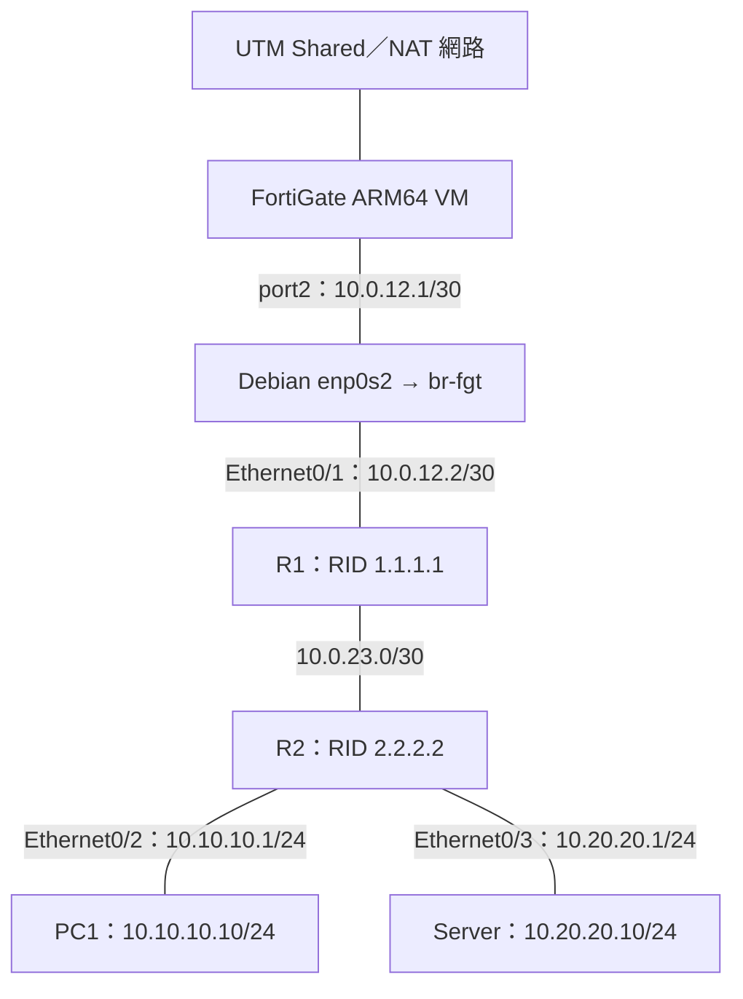

# FortiGate 與 Cisco IOL：UTM OSPF Lab

這次實驗把 UTM 中的 FortiGate ARM64 VM 接到 Debian ARM64 內的 Containerlab，串接 R1、R2，再由 R2 連接 PC1 與 Server。目標是先建立 OSPF 路由交換，並記錄 FortiGate 安裝、介面設定與路由監看。

## 1. 環境與拓樸

| 元件 | 本次規劃／使用方式 |
| --- | --- |
| 主機 | Apple Silicon Mac（M5） |
| VM 平台 | UTM |
| FortiGate | ARM64 VM；截圖顯示 FortiOS 8.0.1 |
| Containerlab 主機 | Debian ARM64，執行 Docker 與 Containerlab |
| Router | Cisco IOL，映像標籤 `vrnetlab/cisco_iol:17.15.1` |
| PC1、Server | Linux container，`ghcr.io/srl-labs/alpine` |
| 實驗目錄 | Debian 的 `~/labs/forti2cisco/` |



FortiGate 是獨立 VM；R1、R2、PC1 和 Server 在 Debian 的 Containerlab 裡。Debian 的管理介面與實驗介面分開，`br-fgt` 將第二張網卡與 R1 的資料介面接在同一個二層網路。

| 設備／介面 | 位址 | 用途 |
| --- | --- | --- |
| FortiGate port1 | `192.168.64.2/24`（管理位址；截圖確認 connected 網段） | UTM Shared／NAT、GUI 管理與外部出口 |
| FortiGate port2 | `10.0.12.1/30` | 接 R1 |
| R1 Ethernet0/1 | `10.0.12.2/30` | 接 FortiGate |
| R1 Ethernet0/2 | `10.0.23.1/30` | 接 R2 |
| R1 Loopback0 | `1.1.1.1/32` | OSPF Router ID |
| R2 Ethernet0/1 | `10.0.23.2/30` | 接 R1 |
| R2 Ethernet0/2 | `10.10.10.1/24` | PC1 gateway |
| R2 Ethernet0/3 | `10.20.20.1/24` | Server gateway |
| R2 Loopback0 | `2.2.2.2/32` | OSPF Router ID |
| PC1 eth1 | `10.10.10.10/24` | default gateway `10.10.10.1` |
| Server eth1 | `10.20.20.10/24` | default gateway `10.20.20.1` |

FortiGate Router ID 為 `3.3.3.3`，三台 Router 使用 Area 0。Router ID 是識別碼，不表示 FortiGate 已建立 `3.3.3.3/32` 的 loopback。

## 2. FortiGate 安裝與接線流程

> [!note] 重建流程與實作紀錄
> 以下依這次拓樸整理重建順序。未留下實際安裝輸出的 UTM 匯入與資源配置細節，不記為已驗證步驟；VM 的 CPU、RAM、磁碟與映像下載檔名待補。

### 2.1 建立 UTM VM

1. 準備 FortiGate ARM64 VM 映像，在 UTM 建立／匯入 FortiGate VM；確認映像架構與 VM backend 相容。
2. FortiGate 第一張網卡作管理與外部出口，對應 `port1`；本次 GUI 管理位址為 `192.168.64.2`。
3. 建立 Debian ARM64 VM，第一張網卡作管理；第二張網卡接實驗二層網路。
4. FortiGate `port2` 與 Debian 第二張網卡必須能互相交換二層封包。UTM 的 Bridged 設定需指向同一個可互通的網路，不能只因兩邊都寫 Bridged 就視為接線完成。
5. 在 Debian 驗證實際介面名稱；本次拓樸使用 `enp0s1` 管理、`enp0s2` 實驗，重建時以 `ip -br link` 為準。

### 2.2 在 Debian 建立 bridge，接到 Containerlab

Containerlab 的 `kind: bridge` 引用既有 bridge，必須先在 Debian 建立，參考 [Linux bridge 文件](https://containerlab.dev/manual/kinds/bridge/)。以下是暫時設定，Debian 重開機後須由主機網路設定或初始化腳本重建。

確認 `enp0s2` 為實驗專用介面後：

```bash
sudo ip link add br-fgt type bridge
sudo ip link set br-fgt up
sudo ip link set enp0s2 master br-fgt
sudo ip link set enp0s2 up
ip -br link
bridge link
```

若 bridge 已存在，跳過建立指令；若介面原本有 IP／NetworkManager profile，先檢查用途，再將主機 IP 配置到 bridge 或取消實驗介面的三層設定，避免留下衝突。這段橋接不需要把 `10.0.12.1` 配在 Debian；該位址屬於 FortiGate。

接線路徑：`FortiGate port2 → Debian enp0s2 → br-fgt → R1 Ethernet0/1`。先建立 bridge，再部署引用 `br-fgt` 的 Containerlab 拓樸。Debian 上的 Docker、Containerlab 與 IOL 執行環境安裝見 [[Containerlab 安裝與設定指南#UTM Debian ARM64：安裝與排錯]]。

## 3. 本次 Containerlab 拓樸與 Cisco Routing 設定

以下為對應本次接線的設定參考。這次完成的是 FortiGate 與 Cisco 的 Routing；尚未實作 IaC。

```text
forti2cisco/
├── lab.clab.yml
└── configs/
    ├── r1.partial
    └── r2.partial
```

### lab.clab.yml

```yaml
name: forti-lab

topology:
  nodes:
    br-fgt:
      kind: bridge
    r1:
      kind: cisco_iol
      image: vrnetlab/cisco_iol:17.15.1
      startup-config: configs/r1.partial
    r2:
      kind: cisco_iol
      image: vrnetlab/cisco_iol:17.15.1
      startup-config: configs/r2.partial
    pc1:
      kind: linux
      image: ghcr.io/srl-labs/alpine
      exec:
        - ip addr replace 10.10.10.10/24 dev eth1
        - ip link set eth1 up
        - ip route replace default via 10.10.10.1 dev eth1
    server:
      kind: linux
      image: ghcr.io/srl-labs/alpine
      exec:
        - ip addr replace 10.20.20.10/24 dev eth1
        - ip link set eth1 up
        - ip route replace default via 10.20.20.1 dev eth1
  links:
    - endpoints: ["br-fgt:fg", "r1:Ethernet0/1"]
    - endpoints: ["r1:Ethernet0/2", "r2:Ethernet0/1"]
    - endpoints: ["r2:Ethernet0/2", "pc1:eth1"]
    - endpoints: ["r2:Ethernet0/3", "server:eth1"]
```

此範本讓 PC1／Server 的一般流量走實驗 gateway。使用 `replace` 可避免既有 default route 造成 `File exists`；重新指定 default route 後，跨網段的管理回程也可能改走實驗網路，測試時可從 Debian 用 `docker exec` 操作。

### configs/r1.partial

```cisco
interface Loopback0
 ip address 1.1.1.1 255.255.255.255
 ip ospf 1 area 0
!
interface Ethernet0/1
 ip address 10.0.12.2 255.255.255.252
 no shutdown
 ip ospf 1 area 0
 ip ospf network point-to-point
!
interface Ethernet0/2
 ip address 10.0.23.1 255.255.255.252
 no shutdown
 ip ospf 1 area 0
 ip ospf network point-to-point
!
router ospf 1
 router-id 1.1.1.1
 passive-interface default
 no passive-interface Ethernet0/1
 no passive-interface Ethernet0/2
```

### configs/r2.partial

```cisco
interface Loopback0
 ip address 2.2.2.2 255.255.255.255
 ip ospf 1 area 0
!
interface Ethernet0/1
 ip address 10.0.23.2 255.255.255.252
 no shutdown
 ip ospf 1 area 0
 ip ospf network point-to-point
!
interface Ethernet0/2
 ip address 10.10.10.1 255.255.255.0
 no shutdown
 ip ospf 1 area 0
!
interface Ethernet0/3
 ip address 10.20.20.1 255.255.255.0
 no shutdown
 ip ospf 1 area 0
!
router ospf 1
 router-id 2.2.2.2
 passive-interface default
 no passive-interface Ethernet0/1
```

`.partial` 會附加到 Containerlab 的預設管理設定，保留管理介面、VRF 與 SSH；完整 startup-config 則會取代預設設定。設定只在首次啟動套用，已存入 NVRAM 的設定可能優先於新版 startup-config。這些行為見 [Cisco IOL 文件](https://containerlab.dev/manual/kinds/cisco_iol/)。

部署及登入：

```bash
cd ~/labs/forti2cisco
clab deploy -t lab.clab.yml
clab inspect -t lab.clab.yml
docker ps
ssh admin@clab-forti-lab-r1
ssh admin@clab-forti-lab-r2
```

需要重建時，可執行 `clab redeploy --cleanup -t lab.clab.yml`；會清除本次 Lab 的生成狀態，先把想保留的手動設定寫回設定檔。Debian bridge 與 FortiGate VM 的設定不會因此自動重建。

## 4. FortiGate 介面與 OSPF

在 GUI 的 **Network → Interfaces** 設定 `port2 = 10.0.12.1/30`，需要 ping 驗證時允許該介面的 PING 管理存取。

在 **Network → OSPF**：

- Router ID：`3.3.3.3`
- Area ID：`0.0.0.0`，Type：Regular，Authentication：None
- Network：`10.0.12.0/30`，Area：`0.0.0.0`
- Apply 後查看 Neighbors；本次畫面顯示 `10.0.12.2`

![[Assets/Note/Tech/FortiGate 與 Cisco IOL：UTM OSPF Lab/01-ospf-annotated.png]]

範本的 R1 Ethernet0/1 使用 point-to-point，因此 FortiGate 的 port2 OSPF network type 也應設為 point-to-point。截圖未顯示 Interfaces 區的詳細設定，不能據此斷言當時使用哪種 network type。

可用 CLI 補齊對應設定範本：

```text
config router ospf
    set router-id 3.3.3.3
    config area
        edit 0.0.0.0
        next
    end
    config network
        edit 1
            set prefix 10.0.12.0 255.255.255.252
            set area 0.0.0.0
        next
    end
    config ospf-interface
        edit "to-r1"
            set interface "port2"
            set network-type point-to-point
        next
    end
end
```

語法與 network type 可參考 [Fortinet OSPF CLI 文件](https://docs.fortinet.com/document/fortigate/7.4.9/cli-reference/103419153/config-router-ospf)；此文件版本為 7.4.9，本次 8.0.1 須以設備 CLI 支援的選項為準。

## 5. Network Monitor 與路由驗證

GUI 位置：**Dashboard → Network Monitor → Routing**。OSPF 頁面的 **View Routing Monitor** 也可導向路由監看。

![[Assets/Note/Tech/FortiGate 與 Cisco IOL：UTM OSPF Lab/02-network-monitor-annotated.png]]

本次畫面共有 8 筆路由：5 筆 OSPF、2 筆 Connected、1 筆 Static。

| Network | Gateway | Interface | Distance | Type |
| --- | --- | --- | --- | --- |
| `0.0.0.0/0` | `192.168.64.1` | port1 | 5 | Static |
| `1.1.1.1/32` | `10.0.12.2` | port2 | 110 | OSPF |
| `2.2.2.2/32` | `10.0.12.2` | port2 | 110 | OSPF |
| `10.0.12.0/30` | `0.0.0.0` | port2 | 0 | Connected |
| `10.0.23.0/30` | `10.0.12.2` | port2 | 110 | OSPF |
| `10.10.10.0/24` | `10.0.12.2` | port2 | 110 | OSPF |
| `10.20.20.0/24` | `10.0.12.2` | port2 | 110 | OSPF |
| `192.168.64.0/24` | `0.0.0.0` | port1 | 0 | Connected |

`10.0.12.2` 是 R1；兩個 LAN 路由出現在 FortiGate，表示 R2 後方網段已傳播到 FortiGate。GUI 的 Neighbors 欄位沒有提供完整鄰居狀態，若要確認 FULL，仍須查 CLI。

Cisco 驗證：

```text
show ip interface brief
show ip ospf neighbor
show ip route ospf
```

FortiGate 驗證：

```text
get router info ospf neighbor
get router info routing-table all
```

## 6. 延伸連通測試

### 連通驗證順序

1. PC1 ping `10.10.10.1`；Server ping `10.20.20.1`，先確認各自 gateway。
2. PC1 ping `10.20.20.10`，確認 R2 兩個 LAN 的互通。
3. PC1／Server ping `10.0.12.1`，確認到 FortiGate；注意 FortiGate 介面是否允許 PING。
4. 檢查 R1／R2 對外 default route，及 FortiGate LAN 的回程路由。
5. 建立 FortiGate `port2 → port1` 的允許政策及來源 NAT。
6. 分別測試外部 IP 與 DNS 名稱，區分路由／NAT 問題與 DNS 問題。