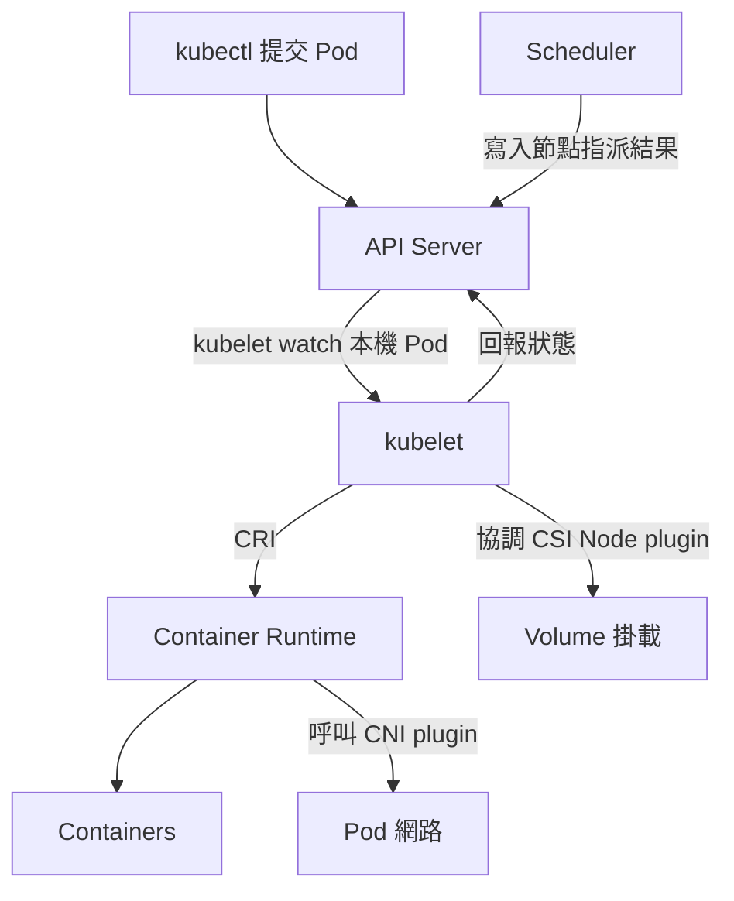

# K8s kubelet 與 Pod 執行流程

## kubelet 的位置與責任

kubelet 是每個 Node 上的節點代理程式。Node 是執行工作負載的實體機或虛擬機，以及 Kubernetes 中對應的資源物件；kubelet 是其上的程式，兩者不是同義詞。

Scheduler 決定 Pod 要放在哪台 Node；kubelet 持續協調已指派到本機的 Pod，透過 CRI 呼叫 containerd、CRI-O 等 runtime 建立 Pod sandbox、啟動及停止容器，並回報狀態。



這是一般由 API Server 管理的 Pod 流程；static Pod 可由 kubelet 讀取本機 manifest 管理。

| 功能 | 主要責任 |
|---|---|
| Pod 排程 | kube-scheduler |
| 容器生命週期 | kubelet 透過 CRI 請 runtime 執行 |
| 健康檢查 | kubelet 管理 startup、liveness、readiness probes |
| Pod 網路設定 | Linux 上通常由 CRI runtime 呼叫 CNI plugin |
| Volume 掛載 | kubelet 協調 CSI Node plugin 與 runtime |
| Service 轉送 | kube-proxy，或具備替代能力的網路實作 |

readiness 失敗會影響 Pod 是否作為 Service 的就緒後端；liveness 失敗可能觸發容器重啟；startup probe 成功前會延後其他兩類探測。

元件責任參考 [Kubernetes Components](https://kubernetes.io/docs/concepts/overview/components/)。容器層延伸至 [[K8s Container Runtime 與 dockershim 遷移]]，網路與儲存分別見 [[K8s CNI 比較：Cilium、Calico 與 Flannel]]、[[K8s CSI、PV、PVC 與雲端儲存]]。

## API 與應用設定

「No hidden internal APIs」可以理解為核心元件透過 API Server 存取 Kubernetes 資源，外部工具也能在授權範圍內使用這些 API。這不代表所有元件的所有通訊都經 API Server，例如 kubelet 與 runtime 使用 CRI。

「Meet users where they are」是配合既有應用的使用方式。應用可以從環境變數或掛載檔案讀取 ConfigMap、Secret，不必為此自行呼叫 Kubernetes API。Secret 的 base64 編碼本身不是加密。

## 檢查方向

```bash
kubectl get nodes -o wide
kubectl get pods -A -o wide
kubectl describe pod <pod-name> -n <namespace>
```

先區分 Pending 是排程問題，還是已分配 Node 後卡在 image pull、sandbox/network、volume mount 等階段。Node 上的 kubelet 服務名稱依安裝方式不同，不把一般 systemd 的服務名稱直接套用到 MicroK8s。
