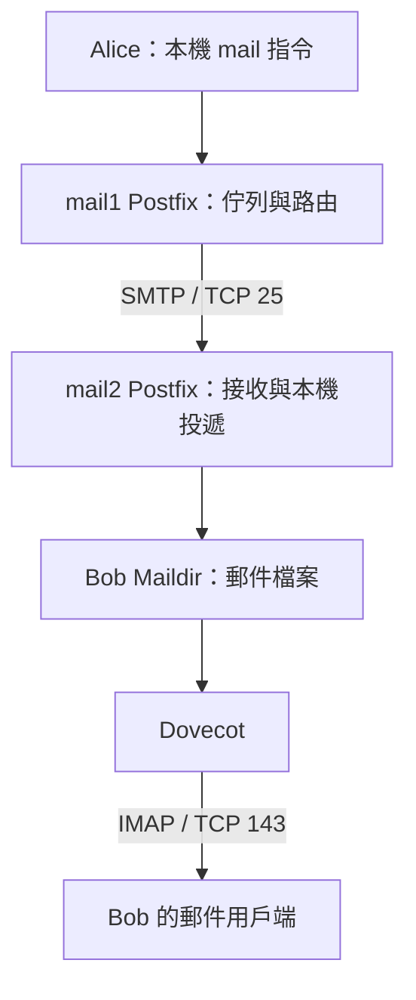

# Linux Mail Server：Postfix、Dovecot 與 Maildir 設定指南

來源：[MailServer 設定對話](chatgpt-conversation://6aad7afb-391c-83e8-acce-c9d8c8be4b1d)  
目錄：[[DevOps Technology Overview]]

本實驗先完成單台主機的本機投遞與 IMAP 讀信，再設定兩台 Postfix 之間的 SMTP 路由。以下整理最後採用的 **CDB + IP transport map**，保留實際操作中遇到的問題。

## 架構與角色

| 元件／協定 | 用途 | 本次實驗 |
| --- | --- | --- |
| Postfix | 郵件傳輸代理（MTA），處理 SMTP、佇列與投遞 | 本機投遞、跨主機 SMTP |
| Maildir | 檔案系統上的信箱儲存格式，一封信一個檔案 | `/home/bob/Maildir/` |
| Dovecot | 提供使用者存取信箱的服務 | 透過 IMAP 讀取 Maildir |
| SMTP | 提交／傳送郵件 | 手動 SMTP 與主機間 TCP 25 |
| IMAP | 列出信箱、讀取郵件及管理狀態 | Dovecot TCP 143 |
| POP3 | 另一種讀取／下載郵件的協定 | 本次沒有測試 |



分工的意義是把「郵件如何送達」、「郵件放在哪裡」與「使用者如何讀取」分開。Maildir 是儲存格式，不是網路服務；本實驗由 Postfix 寫入、Dovecot 讀取同一個信箱。Dovecot 也有 LDA／LMTP 投遞能力，但本實驗未使用。

本機 `mail` 指令通常透過 sendmail 相容介面提交給 Postfix，不能把這一步直接當成已測試 SMTP submission 587。

## 實驗環境

| 項目 | mail1 | mail2 |
| --- | --- | --- |
| 系統 | Debian | Debian |
| IP（對話當時） | `192.168.139.14` | `192.168.139.240` |
| Postfix 主機名稱 | `mail.lab1.test` | `mail.lab2.test` |
| 郵件網域 | `lab1.test` | `lab2.test` |
| 主要測試使用者 | `alice` | `bob` |
| Transport backend | `cdb` | `cdb`（需先確認套件支援） |

最初單機階段使用 `mail.lab.test`／`lab.test`，之後改成 `lab1.test`。下方統一以雙機階段的名稱說明。原始 IP 輸出為 DHCP 動態位址，重做實驗時應先核對 IP。

## 1. Postfix 本機投遞

Debian 所需套件可整理為：

```bash
sudo apt update
sudo apt install postfix mailutils dovecot-imapd netcat-openbsd
```

`mail` 由 Mailutils 提供；`nc` 是 `netcat-openbsd` 安裝後的指令名稱。已有套件與使用者時不必重建。

mail1 的 `/etc/postfix/main.cf` 核心設定：

```ini
myhostname = mail.lab1.test
mydomain = lab1.test
myorigin = $mydomain
mydestination = $myhostname, $mydomain, localhost.$mydomain, localhost
home_mailbox = Maildir/
```

mail2 採相同結構，將前兩行改成：

```ini
myhostname = mail.lab2.test
mydomain = lab2.test
```

| 設定 | 意義 |
| --- | --- |
| `myhostname` | 這台郵件伺服器的完整主機名稱 |
| `mydomain` | 郵件網域變數；單獨設定它不等於接受該網域郵件 |
| `myorigin` | 本機提交的未完整限定地址使用的網域；不保證改寫用戶端已填好的地址 |
| `mydestination` | 由這台主機進行本機投遞的目的網域 |
| `home_mailbox` | 相對於使用者家目錄的信箱路徑；尾端 `/` 表示 Maildir |

單機測試需在 mail1 有 `alice`、`bob` 帳號；跨機測試至少需 mail1 的 `alice` 與 mail2 的 `bob`。帳號不存在時建立：

```bash
sudo adduser alice
sudo adduser bob
```

在有 Bob 帳號的主機建立信箱目錄：

```bash
sudo -u bob mkdir -p /home/bob/Maildir/{tmp,new,cur}
```

```text
/home/bob/Maildir/
├── tmp/    暫存寫入中的郵件
├── new/    新投遞、尚未由用戶端處理的郵件
└── cur/    用戶端已處理的郵件與狀態旗標
```

`cur` 不代表每封信都已讀；已讀狀態另由旗標表示。檢查設定並重新載入：

```bash
sudo postfix check
sudo postfix reload
postconf myhostname mydomain myorigin mydestination home_mailbox
```

在 mail1 測本機投遞：

```bash
sudo -u alice mail -s "local delivery test" bob@lab1.test
```

若出現 `Cc:`，直接 Enter；輸入本文後在新行按 `Ctrl+D` 結束。檢查：

```bash
sudo ls -lah /home/bob/Maildir/new/
mailq
sudo journalctl -u postfix -n 50 --no-pager
```

預期日誌包含 `relay=local` 與 `status=sent (delivered to maildir)`。這表示本機投遞成功，尚不能證明跨主機寄信成功。

## 2. Dovecot 與 IMAP 讀信

先看版本：

```bash
dovecot --version
```

對話最後採用 Dovecot 2.4 系列的分拆設定，修改 `/etc/dovecot/conf.d/10-mail.conf`：

```ini
mail_driver = maildir
mail_home = /home/%{user | username}
mail_path = ~/Maildir
```

取消舊的 `mail_inbox_path = /var/mail/%{user}` 或 `mail_inbox_path = ~/Maildir/.INBOX`。本實驗 INBOX 就在 `~/Maildir`，另外指定 `.INBOX` 會讓 Dovecot 與 Postfix 看向不同位置。2.3 常見的 `mail_location = maildir:~/Maildir` 不應直接混入這份 2.4 設定。[Dovecot Mail Location](https://doc.dovecot.org/2.4.1/core/config/mail_location.html)

```bash
sudo dovecot -n
sudo systemctl enable --now dovecot
sudo systemctl restart dovecot
sudo systemctl status dovecot
sudo ss -lntp
```

確認監聽 TCP 143，再於同一台主機測試：

```bash
nc localhost 143
```

收到 `* OK ... Dovecot ready.` 後依序輸入；將密碼佔位文字換成 Bob 的實驗帳號密碼：

```text
A001 LOGIN bob "Bob的實驗密碼"
A002 LIST "" "*"
A003 SELECT INBOX
A004 FETCH 1 BODY[HEADER]
A005 FETCH 1 BODY.PEEK[]
A006 LOGOUT
```

| 指令 | 用途 |
| --- | --- |
| `LOGIN` | 驗證使用者身分 |
| `LIST "" "*"` | 以空的參考名稱列出符合 `*` 的信箱 |
| `SELECT INBOX` | 開啟收件匣，查看信件數量等資訊 |
| `FETCH 1 BODY[HEADER]` | 讀取目前信箱第 1 封信的標頭 |
| `FETCH 1 BODY.PEEK[]` | 讀取完整郵件，不因這次讀取設為已讀 |
| `LOGOUT` | 登出 |

`A001` 是 IMAP **tag**，用來對應命令與回應，例如 `A001 OK`。可以用 `a`、`b` 等不同標記，但一般 IMAP 命令不能省略 tag；伺服器的 `*` 回應則是不帶命令 tag 的資訊。信箱要有郵件才能執行上述 `FETCH 1`。

此處重現的是 localhost 實驗；遠端用戶端的加密與登入設定需另外配置，不能將這份測試當作已完成 TLS／正式 submission 設定。

## 3. 兩台主機的 CDB 路由

目標：`alice@lab1.test → mail1 → SMTP → mail2 → bob@lab2.test`。

先在兩台檢查 backend：

```bash
postconf -m
postconf default_database_type
```

原始輸出顯示 mail1 有 `hash`、`cdb`、`lmdb`，mail2 當時有 `hash`，但沒有 `cdb`／`lmdb`。同為 Debian 不代表安裝的 backend 相同；兩台也不必使用相同 backend 才能透過 SMTP 通訊，這次統一 CDB 是為了方便操作與排錯。

缺少 CDB 的主機先安裝，再確認 `postconf -m` 列出 `cdb`：

```bash
sudo apt install postfix-cdb
postconf -m
```

**mail1：** 編輯 `/etc/postfix/transport`：

```text
lab2.test    smtp:[192.168.139.240]
```

**mail2：** 若也要反向寄回 mail1，編輯 `/etc/postfix/transport`：

```text
lab1.test    smtp:[192.168.139.14]
```

`smtp:` 指定 SMTP transport；方括號抑制 MX 查詢。若寫 `[mail.lab2.test]`，仍需把主機名稱解析成 IP；此實驗改用 `[192.168.139.240]`，避免依賴該名稱的 DNS 解析。[Postfix transport(5)](https://www.postfix.org/transport.5.html)

兩台分別建立自己的 map 並指定 Postfix 使用它：

```bash
sudo postmap cdb:/etc/postfix/transport
sudo postconf -e 'transport_maps = cdb:/etc/postfix/transport'
sudo postfix check
sudo postfix reload
```

若要沿用對話中「預設也統一為 CDB」的選擇，可另外設定：

```bash
sudo postconf -e 'default_database_type = cdb'
```

這不會自動轉換其他既有 map，也不會改掉明寫的 `hash:`／`lmdb:`。筆記仍使用明確的 `postmap cdb:...`，避免依賴預設值。

mail1 查詢：

```bash
postmap -q lab2.test cdb:/etc/postfix/transport
```

預期：`smtp:[192.168.139.240]`。

mail2 的反向查詢：

```bash
postmap -q lab1.test cdb:/etc/postfix/transport
```

預期：`smtp:[192.168.139.14]`。在 mail2 查 `lab2.test` 沒有輸出，只代表這張 map 沒有該 key；本機網域可由 `mydestination` 處理，不需要另加一條指向自己的路由。

### DB 是什麼？

這裡的 DB 是持久化的 **key-value lookup database**，用於查詢路由，不是郵件內容的儲存庫。

```text
/etc/postfix/transport             人工編輯的文字
  lab2.test → smtp:[192.168.139.240]
              │
              │ postmap cdb:/etc/postfix/transport
              ▼
/etc/postfix/transport.cdb         Postfix 查詢的索引檔
```

| Backend | 常見檔案 | 說明 |
| --- | --- | --- |
| `hash` | `transport.db` | Berkeley DB hash map |
| `cdb` | `transport.cdb` | Constant Database，適合建立後大量讀取的查詢表 |
| `lmdb` | `transport.lmdb` | Lightning Memory-Mapped Database |

`default_database_type` 決定省略類型時 `postmap` 建立什麼；`transport_maps` 決定郵件路由使用哪張表。兩者必須與實際存在的檔案一致。明確使用 `cdb:` 時，不需要在設定路徑末端再寫 `.cdb`。[Debian postmap(1)](https://manpages.debian.org/unstable/postfix/postmap.1.en.html)

每次修改文字 map 後都需重新 `postmap cdb:/etc/postfix/transport`；只 reload 不會重建索引。修改 `main.cf` 後要 reload。目錄中同時有 `.db`、`.cdb`、`.lmdb`，也不代表三個都正在使用。[Postfix Standard Configuration](https://www.postfix.com/STANDARD_CONFIGURATION_README.html)

## 4. 寄信測試與驗證

先在 mail1 測 mail2 的 TCP 25：

```bash
nc -vz 192.168.139.240 25
```

成功只證明 TCP 可連線。接著寄信：

```bash
sudo -u alice mail -s "lab1 to lab2" bob@lab2.test
```

`Cc:` 留空，輸入本文，按 `Ctrl+D`。mail1 檢查：

```bash
mailq
sudo journalctl -u postfix -n 100 --no-pager
```

預期看到同一封信的記錄包含：

```text
to=<bob@lab2.test>
relay=192.168.139.240[192.168.139.240]:25
status=sent
```

mail2 再檢查：

```bash
sudo journalctl -u postfix -n 100 --no-pager
sudo ls -lah /home/bob/Maildir/new/ /home/bob/Maildir/cur/
```

應確認 mail2 的本機投遞記錄，以及 Bob 信箱中的對應郵件；最後用 IMAP 讀取。mail1 的 `status=sent` 表示下一站接受郵件，不等同 Bob 已讀取。郵件也可能已從 `new` 移到 `cur`，不能只憑 `new` 空白判定未收到。

如需反向測試，在 mail2 以 Bob 寄給 `alice@lab1.test`，並在 mail1 驗證 Alice 的投遞與信箱；前提是反向 map、帳號與接收端設定已備妥。

### 手動觀察 SMTP

在 mail1 直接連 mail2：

```bash
nc -C 192.168.139.240 25
```

`-C` 是 OpenBSD nc 的 CRLF 換行選項。逐行輸入並等待伺服器回應：

```text
EHLO mail.lab1.test
MAIL FROM:<alice@lab1.test>
RCPT TO:<bob@lab2.test>
DATA
From: alice@lab1.test
To: bob@lab2.test
Subject: manual SMTP test

Hello Bob
.
QUIT
```

`DATA` 回覆 `354` 後才輸入內容；標頭與本文之間需有空行，單獨一行 `.` 結束內容。`MAIL FROM`／`RCPT TO` 是投遞用的 envelope，信內 `From:`／`To:` 是標頭，兩者概念不同。

這項測試直接驗證 mail2 的 SMTP 接收與投遞，會繞過 mail1 的佇列與 transport map；要驗證 mail1 路由仍需使用前面的 `mail` 測試。

## 5. 排錯順序與本次遇到的問題

按 **寄件地址與 queue → map 與設定 → TCP 25 → 接收端 SMTP → 本機投遞 → Maildir → IMAP** 逐段定位。

| 現象 | 解讀與處理 |
| --- | --- |
| 找不到 `transport.db` | 設定指定 `hash:`，但相應索引不存在；檢查 `postconf transport_maps` 並使用一致的 backend |
| 找不到 `transport.lmdb` | 查詢了未建立的 LMDB map；本筆記最後採 CDB，不必再補建 LMDB |
| `unsupported map type: cdb` | 用 `postconf -m` 確認支援，缺少時安裝 `postfix-cdb` |
| `mail.lab2.test type=AAAA: Host not found` | 指定的主機名稱無法解析；方括號只跳過 MX，不跳過名稱解析 |
| `status=deferred` | 暫時失敗、留在佇列等待重試；看同一筆記錄的原因 |
| `relay=local` 且收件人是 `root@lab1.test` | 這封是本機測試，不能當成 mail1 → mail2 成功證據 |
| TCP 25 refused／timeout | 檢查接收端服務、`inet_interfaces`、監聽位址、路由與防火牆 |
| `Relay access denied` | 檢查接收端是否把目的網域列為本機目的地；不要為此開放任意 relay |
| Maildir 有信但 IMAP 看不到 | 檢查 Dovecot 路徑、`mail_inbox_path`、帳號及檔案權限 |

接收端快速檢查：

```bash
postconf myhostname mydomain mydestination home_mailbox inet_interfaces
getent passwd bob
sudo ss -lntp
sudo dovecot -n
```

修好原因後，若信還在 deferred queue，可要求重試：

```bash
sudo postqueue -f
mailq
```

若 `journalctl -u postfix` 沒有郵件交易記錄，也查看系統的 syslog 設定與 `/var/log/mail.log`（若存在）。使用時間、收件人與 queue ID 對照，不能只看任一筆 `status=sent`。

## 對話中已確認的結果

- **單機 Maildir 投遞：已確認。** 原始輸出有 `/home/bob/Maildir/new/` 的郵件檔案。
- **單機 IMAP 讀信：已確認。** 原始輸出有 Bob 收件匣的 `FETCH` 郵件標頭與 `OK Fetch completed`。
- **mail1 的 CDB 路由查詢：已確認。** `lab2.test` 查詢回傳 `smtp:[192.168.139.240]`。
- **雙機端到端寄收信：尚待驗證。** 最後貼出的結果未包含跨機 SMTP 成功與 mail2 對應郵件的完整證據。
- **POP3、TLS、submission 587、公開 DNS MX 與外網寄信：不列為本次已完成項目。**
