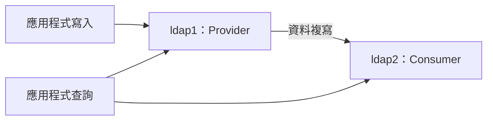
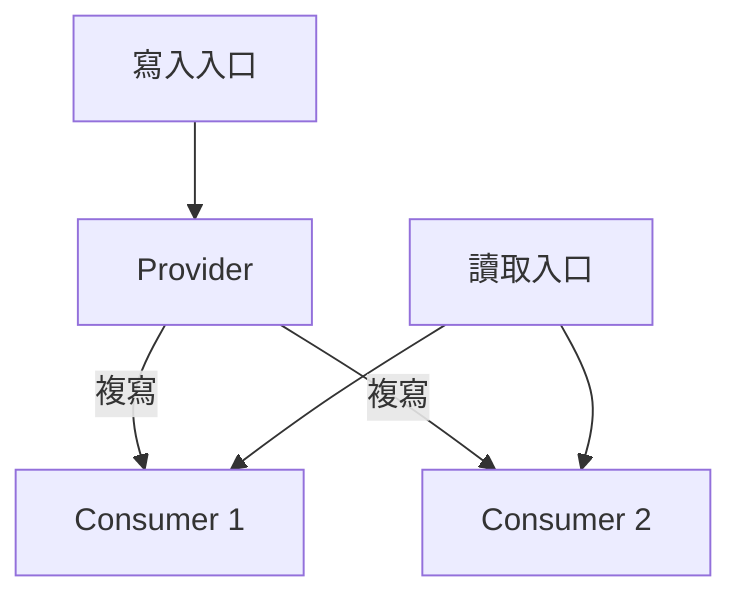
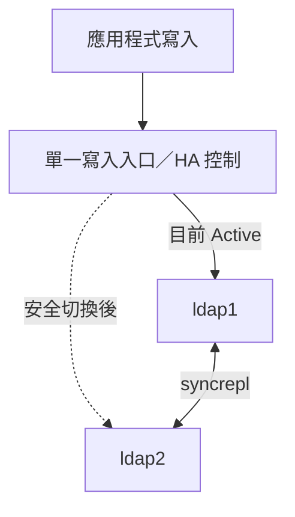

---
Type:
  - Linux LDAP
OS:
  - Debian
---
## 設定流程

如果確定要架設 LDAP 作為你的身份驗證來源，那麼你得要事先規劃好這部 LDAP 所提供的 baseDN、相關的管理者密碼、相關的帳號 UID 起始號碼、 相關的使用者家目錄 (最好不要跟系統預設的 /home 相同位置，否則容易造成本機帳號與網路帳號衝突的狀況)等等。至於一般的架設流程大概是這樣的

1. 安裝LDAP，並提供登入LDAP功能的RootDN密碼
2. 載入 LDAP 所需要的環境設定參數檔
3. 啟動 LDAP 服務，並觀察 LDAP 服務的埠口，以啟用防火牆放行的功能
4. 預先指定好自己公司即將使用的 baseDN 環境 (最好與 DNS 系統相同即可)，同時規劃好即將要使用的用戶端作業系統有哪些
5. 開始載入基本的 baseDN 功能
6. 開始載入用戶端作業系統所需要的schema
7. 嘗試取得用戶端所需要的帳號參數範例檔，變轉為 LDAP 所需要的格式 (LDAP Data Interchange Format, LDIF) ，然後載入到 LDAP 伺服器內
8. 若需要加密環境，請前往 /etc/pki/tls/certs 目錄下進行所需要的 key 建制

## 設定FQDN

```Plain
hostnamectl set-hostname ldap.mydomain.local
```

```Shell
vim /etc/hosts
192.168.10.50 ldap.mydomain.local ldap
```

## 安裝

`slapd` 是 OpenLDAP 的伺服器程序，`ldap-utils` 提供管理與查詢 LDAP 的命令工具。

```Plain
apt install slapd ldap-utils
```

![[Assets/Note/Tech/Linux OpenLDAP 設定指南/01-安裝.png|01-安裝.png]]

![[Assets/Note/Tech/Linux OpenLDAP 設定指南/02-安裝.png|02-安裝.png]]

- 也會多一個使用者openldap這個系統使用者
    
    ![[Assets/Note/Tech/Linux OpenLDAP 設定指南/03-安裝.png|03-安裝.png]]
    
- 另外還回新增一個在LDAP裡面的admin使用者
- 系統會多出一個 `port 389` 的埠口
    
    ![[Assets/Note/Tech/Linux OpenLDAP 設定指南/04-安裝.png|04-安裝.png]]
    
- 另外可以使用ldapsearch
    - 檢查server會不會給回應
        
        ```Shell
        ldapsearch -xb '' -s base '(objectclass=*)' namingContexts
        ```
        
    - 檢查admin
        
        ```Shell
        ldapsearch -xb 'dc=alrac,dc=net'
        ```
        

---

## LDAP基礎設定

### 更改密碼

可以更改admin的密碼

```Shell
ldappasswd
```

### 顯示基本的訊息

```Shell
slapcat
```

![[Assets/Note/Tech/Linux OpenLDAP 設定指南/05-顯示基本的訊息.png|05-顯示基本的訊息.png]]

### dpkg的方式設定

接下來，運行以下命令以重新設定 OpenLDAP 的“_slapd”。_

```Shell
dpkg-reconfigure slapd
```

- **當系統**要求刪除/省略舊的 OpenLDAP 配置時，請選擇否。這將使舊配置保持可用。
    
    ![[Assets/Note/Tech/Linux OpenLDAP 設定指南/06-dpkg的方式設定.png|06-dpkg的方式設定.png]]
    
- 現在輸入 OpenLDAP 伺服器的 DNS 本地域名，然後選擇**“確定”。**
    
    ![[Assets/Note/Tech/Linux OpenLDAP 設定指南/07-dpkg的方式設定.png|07-dpkg的方式設定.png]]
    
- 輸入組織名稱，然後選擇**確定**。（可選）您可以將其保留為預設值，其名稱與功能變數名稱相同。
    
    ![[Assets/Note/Tech/Linux OpenLDAP 設定指南/08-dpkg的方式設定.png|08-dpkg的方式設定.png]]
    
- 現在輸入 OpenLDAP 管理員密碼，然後選擇**「確定」**以繼續
    
    ![[Assets/Note/Tech/Linux OpenLDAP 設定指南/09-dpkg的方式設定.png|09-dpkg的方式設定.png]]
    
- 確認密碼
    
    ![[Assets/Note/Tech/Linux OpenLDAP 設定指南/10-dpkg的方式設定 - 確認密碼.png|10-dpkg的方式設定 - 確認密碼.png]]
    
- 當系統要求刪除舊的 slapd 資料庫時，請選擇“**否**”。
    
    ![[Assets/Note/Tech/Linux OpenLDAP 設定指南/11-dpkg的方式設定.png|11-dpkg的方式設定.png]]
    
- 現在，選擇“**是**”以改變舊的 slapd 資料庫。
    
    ![[Assets/Note/Tech/Linux OpenLDAP 設定指南/12-dpkg的方式設定.png|12-dpkg的方式設定.png]]
    
- 要驗證 OpenLDAP 配置，請運行下面的“_slapcat_”命令。
    
    ![[Assets/Note/Tech/Linux OpenLDAP 設定指南/13-dpkg的方式設定.png|13-dpkg的方式設定.png]]
    
- 重新啟動slapd
    
    ```Plain
    sudo systemctl restart slapd
    sudo systemctl status slapd
    ```
    
    ![[Assets/Note/Tech/Linux OpenLDAP 設定指南/14-dpkg的方式設定 - 重新啟動slapd.png|14-dpkg的方式設定 - 重新啟動slapd.png]]
    

---

## LDIF

- LDIF (LDAP Data Interchange Format)
    - 撰寫時，以冒號隔開節點名稱和key value
    - 冒號左側不能有空白，右側需要一個空白，開始填寫資料
    - 每個節點都是由dn: 開頭，且需要完整的寫入該節點 (連同 baseDN 的資料)
    - 在 dn 之後寫入你想要影響的項目，然後底下加入所需要的動作或者是資料
    - 若資料延伸到第二行，則需要在行首保留一個空白字元
    - 最終需要保留一個空白行

### 新增OU

- 新增一個看得懂的名稱，可以亂取名子，但是建議要像程式變數一樣

```Shell
vim /etc/ldap/users.ldif
```

- 打上ldif內容
    
    ```Shell
    dn: ou=People,dc=mydomain,dc=local
    objectClass: organizationalUnit
    ou: People
    ```
    
    ![[Assets/Note/Tech/Linux OpenLDAP 設定指南/15-新增OU.png|15-新增OU.png]]
    
- 新增
    
    ```Shell
    sudo ldapadd -D "cn=admin,dc=mydomain,dc=local" -W -H ldapi:/// -f users.ldif
    ```
    
    ![[Assets/Note/Tech/Linux OpenLDAP 設定指南/16-新增OU.png|16-新增OU.png]]
    
- 查詢
    
    ```Shell
    sudo ldapsearch -x -b "dc=mydomain,dc=local" ou
    ```
    
    ![[Assets/Note/Tech/Linux OpenLDAP 設定指南/17-新增OU - 查詢.png|17-新增OU - 查詢.png]]
    

### 新增一個使用者

- 開啟一個檔案
    
    ```Shell
    vim alice.ldif
    ```
    
- 編寫ldif
    
    ```Shell
    dn: cn=alice,ou=People,dc=mydomain,dc=local
    objectClass: top
    objectClass: account
    objectClass: posixAccount
    objectClass: shadowAccount
    cn: alice
    uid: alice
    uidNumber: 10001
    gidNumber: 10001
    homeDirectory: /home/alice
    userPassword: AlicePassword
    loginShell: /bin/bash
    ```
    
- 建立
    
    ```Shell
    sudo ldapadd -D "cn=admin,dc=mydomain,dc=local" -W -H ldapi:/// -f alice.ldif
    ```
    
- 查詢
    
    ```Shell
    sudo ldapsearch -x -b "ou=People,dc=mydomain,dc=local"
    ```
    
    ![[Assets/Note/Tech/Linux OpenLDAP 設定指南/18-新增一個使用者 - 查詢.png|18-新增一個使用者 - 查詢.png]]
---

## 複寫：從一台 LDAP 到多台

LDAP 是存取目錄的協定，OpenLDAP 是實作。橫向擴展前，先分清楚要增加的是**查詢容量、寫入容量，還是故障時的可用性**。這三件事需要不同設計。

相關概念：[[LDAP (Light-weight Directory Access Protocol)]]。

### Provider、Consumer 與 syncrepl

這次 Lab 採用 Single-Provider 架構；本節沿用 `dc=lab,dc=test`，與前面安裝範例的 `dc=mydomain,dc=local` 是不同環境，不能混用。



Provider 提供資料，Consumer 接收副本，概念上對應以前的 master / slave。但這是複寫角色：同一台也能同時接收上游資料、再提供給下游。

- Provider 的資料庫掛上 `syncprov` overlay，提供同步能力。
- Consumer 的資料庫設定 `olcSyncRepl`，指定來源、驗證身分與同步範圍。
- **連線由 Consumer 主動建立**，不是 Provider 直接複製 MDB 檔案給另一台。

同步建立在 LDAP Search 加上 Sync Control。流程是 Consumer 連線與 Bind，送出同步搜尋，完成 refresh，再依模式持續追蹤變更：

| 模式 | 行為 | 考量 |
| --- | --- | --- |
| `refreshOnly` | 每隔一段時間重新同步 | 有輪詢間隔造成的延遲 |
| `refreshAndPersist` | refresh 後保持搜尋連線，由 Provider 傳送後續變更 | 仍有傳輸與套用延遲，不是同步提交 |

`entryUUID` 辨認同一筆 entry；DN 可能因 rename / move 改變。`entryCSN` 表示變更版本資訊，`contextCSN` 表示資料庫的複寫進度；多個來源時，要按來源 SID 比較各自進度。Consumer 帶著同步 cookie 重連，讓 Provider 判斷需要補哪些資料。首次空副本、一般追趕與歷史不足時的重新同步，成本並不相同。

來源：[LDAP Content Synchronization（RFC 4533）](https://www.rfc-editor.org/rfc/rfc4533)、[OpenLDAP Replication](https://www.openldap.org/doc/admin26/replication.html)。

### Lab 設定順序與驗證

先確認兩台的 DNS、suffix、schema、網路與驗證能互通。每台使用自己的資料目錄。資料複寫不代表 `cn=config`、ACL、TLS 憑證或模組也自動一致，這些設定要另外管理。

**1. 找出實際的資料庫與模組 DN。** 不要假設所有機器都是 `{1}mdb` 或 `cn=module{0}`。

```bash
sudo ldapsearch -LLL -Q -Y EXTERNAL -H ldapi:/// \
  -b cn=config '(objectClass=olcDatabaseConfig)' dn olcSuffix

sudo ldapsearch -LLL -Q -Y EXTERNAL -H ldapi:/// \
  -b cn=config '(objectClass=olcModuleList)' dn olcModuleLoad
```

**2. 在 ldap1 載入 syncprov，再把 overlay 掛到目標資料庫。** 載入模組與掛上 overlay 是兩件事。以下假設查到的 DN 與 Lab 相同；模組已載入就跳過第一份 LDIF。

`load-syncprov.ldif`：

```ldif
dn: cn=module{0},cn=config
changetype: modify
add: olcModuleLoad
olcModuleLoad: syncprov

```

`provider-syncprov.ldif`：

```ldif
dn: olcOverlay=syncprov,olcDatabase={1}mdb,cn=config
changetype: add
objectClass: olcOverlayConfig
objectClass: olcSyncProvConfig
olcOverlay: syncprov

```

分別透過 `sudo ldapmodify -Q -Y EXTERNAL -H ldapi:/// -f 檔名.ldif` 套用。既有 overlay 應先查詢確認，避免重複新增。

**3. 在 ldap2 設定來源。** 下列是加入 TLS 與專用複寫帳號後的範本，並非可直接套用的完整部署：須先在 Provider 建立該帳號、授予同步範圍所需的讀取權限（含必要 operational attributes 與密碼屬性），並設定兩端憑證及 CA 信任。`REPLACE_ME` 必須換成實際密碼。

```ldif
dn: olcDatabase={1}mdb,cn=config
changetype: modify
add: olcSyncRepl
olcSyncRepl: rid=001 provider=ldap://ldap1.lab.test starttls=critical bindmethod=simple binddn="cn=replicator,dc=lab,dc=test" credentials="REPLACE_ME" searchbase="dc=lab,dc=test" type=refreshAndPersist retry="5 5 300 +"

```

`rid` 辨認本機的複寫設定，不等於 Provider 的 `olcServerID`。`retry="5 5 300 +"` 表示每 5 秒重試、共 5 次，接著每 300 秒持續重試。原 Lab 使用 admin 與未加密連線；正式使用時應改成專用帳號與 TLS，且限制含 credentials 的檔案及設定存取權限。

```bash
# 先看 LDIF 解析結果；輸出可能含複寫密碼，不要直接分享
sudo ldapmodify -n -v -Q -Y EXTERNAL -H ldapi:/// -f consumer-syncrepl.ldif

# 確認後才真正套用
sudo ldapmodify -Q -Y EXTERNAL -H ldapi:/// -f consumer-syncrepl.ldif
```

**4. 查詢兩台並測試持續同步。** 以下命令各在 ldap1、ldap2 本機執行，使用各自主機可用的查詢身分：

```bash
sudo ldapsearch -LLL -x -H ldapi:/// \
  -D 'cn=admin,dc=lab,dc=test' -W \
  -b 'dc=lab,dc=test' '(uid=sync-test)' dn entryUUID entryCSN

sudo ldapsearch -LLL -x -H ldapi:/// \
  -D 'cn=admin,dc=lab,dc=test' -W \
  -b 'dc=lab,dc=test' -s base '(objectClass=*)' contextCSN
```

在 Provider 對測試 entry 執行新增、修改、改名與刪除，再確認 Consumer 的結果；接著測試斷線後重連追趕。看到初始資料不代表所有後續操作都已驗證。`contextCSN` 是進度線索，仍需配合內容、同步範圍與日誌判斷。

| Lab 遇到的問題 | 原因與處理 |
| --- | --- |
| `olcSyncProvConfig` 不被辨識 | 檢查 syncprov 是否載入、名稱與套件是否正確 |
| `Type or value exists (20)` | 先查現況；模組可能已載入，不要反覆新增 |
| `olcDatabas` | 拼錯，正確是 `olcDatabase` |
| `rid=001provider=...` | LDIF 續行會移除第一個前導空白；參數間需另留空白。此範例用單行避免黏接 |
| `intetOrgPerson` | 正確是 `inetOrgPerson`，且需提供繼承自 person 的 `cn`、`sn` |
| dry-run 沒報錯，套用才失敗 | `-n` 不會完成伺服器端的 schema、DN、ACL 或複寫連線驗證 |

## 橫向擴展與容量判斷

### 讀取擴展：一個 Provider、多個 Consumer



這適合查詢量高的目錄：把讀取分散到副本，讓 Provider 專注處理寫入。但副本必須各自套用變更，新增副本也會增加 Provider 的複寫成本。

讀取入口需由 client 或代理實際導流；只新增伺服器不會自動分流。LDAP 使用持久 TCP 連線，連線池可能長時間固定在少數副本，負載不一定平均。普通 TCP Load Balancer 也不會在同一連線中自動辨認 Search 與 Modify，再分送不同後端。

> [!important] 密碼與權限也有複寫延遲
> 在 Provider 修改密碼後，立刻向 Consumer 驗證可能仍讀到舊狀態。需要 read-after-write 的流程應讀目前 Writer，或明確等待同步；停權、群組異動也要考慮相同問題。若使用密碼政策等 overlay，Bind 還可能涉及失敗計數或鎖定狀態更新，不能只把所有登入都當成無副作用讀取。

### CPU 很高時，先辨認工作量

| 觀察結果 | 優先思路 |
| --- | --- |
| Search 多、查詢延遲高 | 檢查實際 filter、索引與搜尋範圍，再增加讀取副本 |
| Bind 多、驗證成本高 | 分析密碼驗證、TLS 與連線重建成本；評估連線重用和驗證流量分配 |
| 寫入或索引更新占主因 | 減少不必要寫入、檢查索引成本，評估 CPU、記憶體與儲存效能 |
| 新副本加入後 Provider 負載升高 | 檢查初始同步與複寫 fan-out，避免同時大量初始化 |
| Consumer 越來越落後 | 檢查 CPU、I/O、網路與套用速率，不能只看服務埠能否連線 |

索引要對應實際查詢；過多索引也會增加寫入成本。普通 syncrepl 以 entry 狀態傳遞更新；若大量修改大 entry 的少數屬性，可評估 delta-syncrepl，但會增加 changelog 管理成本。容量驗證至少比較吞吐量、查詢延遲、CPU、I/O 與複寫落後程度。

**增加 Multi-Provider 不等於把同一份目錄的寫入成本均分。** 每台仍要接收其他節點的更新。若目標是資料或寫入容量真正分片，要另行設計不同 suffix／業務範圍的責任邊界、路由與跨分區查詢；複寫本身不提供自動 sharding。

來源：[OpenLDAP Tuning](https://www.openldap.org/doc/admin26/tuning.html)、[Replication 部署模式](https://www.openldap.org/doc/admin26/replication.html)。

## 高可用：Single-Provider、Mirror Mode 與 Multi-Provider

| 模式 | 複寫方向 | 應用程式寫入 | 主要目的 |
| --- | --- | --- | --- |
| Single-Provider | Provider → Consumers | 單一 Provider | 讀取擴展、維持副本 |
| Mirror Mode | 兩台互相同步 | 外部入口一次只選一台 | Writer 故障切換 |
| Multi-Provider | 多台互相同步 | 多台可接收寫入 | 多處可寫，但需處理衝突與分區 |

**這次 Lab 的 ldap1 → ldap2 屬於 Single-Provider，尚不是 Mirror Mode。** Consumer 有資料副本，不表示 Provider 故障後會自動變成可寫節點。

Mirror Mode 的兩台都具備 Provider 與 Consumer 能力，使用不同 `olcServerID`，由外部 frontend 決定 Active Writer。OpenLDAP 2.6 官方範例使用 `multiprovider on`；對話中的 `olcMirrorMode` 是舊命名，實際 `cn=config` 屬性應依安裝版本核對，不能只照名稱判斷架構。



OpenLDAP 複寫不提供 Raft／Paxos 式的多數派提交。多台可寫時，版本資訊與衝突處理不等於全域交易排序，也不能保證業務上的唯一性，例如兩邊同時分配相同 `uidNumber`。

故障判斷要分層看：程序、TCP、LDAP Bind／Search、複寫進度，以及誰仍有寫入權。網路斷線不代表對方已停止。若兩邊各自認為對方故障並繼續寫入，就會形成 split brain。

Mirror Mode 維持單一 Writer 也不代表零資料遺失：舊 Writer 已回覆成功、但尚未複寫的變更，可能在故障切換時缺失。要先決定能接受的資料遺失範圍（RPO）與恢復時間（RTO）；副本也不能取代可回復誤刪的備份。

來源：[OpenLDAP Mirror Mode 與 Multi-Provider](https://www.openldap.org/doc/admin26/replication.html)。

## Kubernetes 裡的 OpenLDAP

OpenLDAP 可以放進 K8s，但 Pod 重建、資料複寫與 Writer 切換是不同責任。可先用 StatefulSet 部署一個 Provider 與讀取副本；需要寫入 HA 時，再加入經故障驗證的切換機制。

| 元件 | 責任 |
| --- | --- |
| StatefulSet + Headless Service | 穩定的 Pod 身分與 peer 位址 |
| 每個 Pod 獨立 PVC | 各自儲存 MDB；不要讓兩個 slapd 共用同一資料目錄 |
| Anti-affinity／Topology Spread | 把副本分散到不同故障域 |
| PDB | 限制維護時的自願中斷；不保證擋住節點故障 |
| Secret + TLS | 管理認證資訊與加密傳輸；憑證需涵蓋實際連線名稱 |
| Read／Write Service 或代理 | 提供入口與導流；不自動辨識 LDAP 操作 |
| Controller／Operator／HA 元件 | 管理 Writer 身分、封鎖舊 Writer 與切換流程 |

StatefulSet 的 `replicas: 2` 只建立兩個 Pod，不會自動設定 syncrepl、角色或選主。擴容時仍須完成資料初始化、驗證複寫追趕，才能加入讀取流量。

來源：[Kubernetes StatefulSets](https://kubernetes.io/docs/concepts/workloads/controllers/statefulset/)。

### Lease 是協調物件，不是寫入鎖

`Lease` 是 Kubernetes 的 `coordination.k8s.io/v1` 資源，常用於心跳與 leader election。以下只是欄位示意，建立 YAML 本身不會啟動選主：

```yaml
apiVersion: coordination.k8s.io/v1
kind: Lease
metadata:
  name: ldap-writer
spec:
  holderIdentity: ldap-0
  leaseDurationSeconds: 15
```

持有者由程式持續續約，更新 `renewTime`；其他候選者依選舉演算法判斷是否可接手。`acquireTime` 記錄取得租約的時間，`leaseTransitions` 記錄持有者轉換。API 的並行更新控制協助協調競爭，但租約過期不會由 API Server 自動殺掉舊 Writer，也不會自動更新 Service。

> [!warning] Leader election 不保證 fencing
> client-go 官方明確說明，leader election 不保證只有一個 client 正在以 Leader 身分執行。Lease 控制的是協調狀態；**fencing 是讓舊 Writer 實際失去寫入能力**，兩者必須分開設計。

例如 ldap-0 無法存取 API Server，但仍可服務既有 LDAP 連線；ldap-1 接手 Lease 後，ldap-0 的 slapd 並不會因此停止接受寫入。只改 Service endpoint 或 Pod label，也無法保證既有 TCP 連線立即失效。

來源：[Kubernetes Leases](https://kubernetes.io/docs/concepts/architecture/leases/)、[client-go leader election 的限制](https://pkg.go.dev/k8s.io/client-go/tools/leaderelection)。

### 合理的切換流程與練習順序

以下是設計原則，並非已部署或可直接套用的 Operator：

1. 平時只允許一個應用程式 Writer；所有寫入路徑，包括直連 Pod 與既有連線，都納入控制。
2. 無法續約的節點應 fail closed，停止對外寫入。單靠 sidecar 自律仍須考慮程序暫停、控制失效等情境。
3. 新 Writer 啟用前，確認舊 Writer 已被可靠隔離；若無法確認，寧可暫停寫入，不能只憑租約逾時宣稱安全。
4. 檢查候選節點同步狀態，按 RPO 決定是否接手，再開放新 Writer 並更新入口。
5. 舊節點恢復後先追趕與驗證，避免立即搶回 Writer。

不要直接用整個 Pod 的 readiness 代表「可寫」：同一 Pod 可能仍可讀、可複寫；把 Standby 設成 NotReady 可能連讀取入口也一起移除。應分開設計讀取健康與寫入資格，並注意 Service 更新有傳播時間。Kubernetes Service 本身不會讀取 Lease 決定路由。

適合這次 Lab 的進度是：**先驗證單向複寫 → 增加 Consumer 測讀取分流 → 測斷線追趕 → 練習受控的 Writer 切換 → 最後才自動化**。自動化前至少測試 slapd 故障、節點故障、複寫網路分區、API Server 不可達，以及舊 TCP 連線仍存在的情況。

「Lease + 自製 Controller」是一種可行的組成方式，不能只因使用 Kubernetes 元件就稱為 OpenLDAP 的通用標準方案。選現成 HA 元件時，應核對它實際如何 fencing、處理落後副本與復原，而不只看是否支援 leader election。

整理依據：[練習 LDAP 複寫](chatgpt-conversation://6ab1fbe2-8354-83e8-8ee9-c2793d09ae1b)，並於 2026-09-23 核對上述官方文件。此處整理的是 Lab 操作與架構思路，未在實際 LDAP／K8s 環境執行部署或故障測試。
