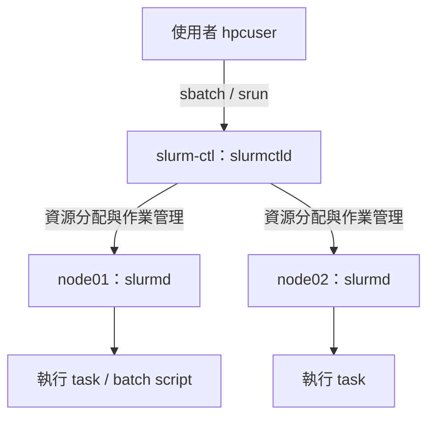
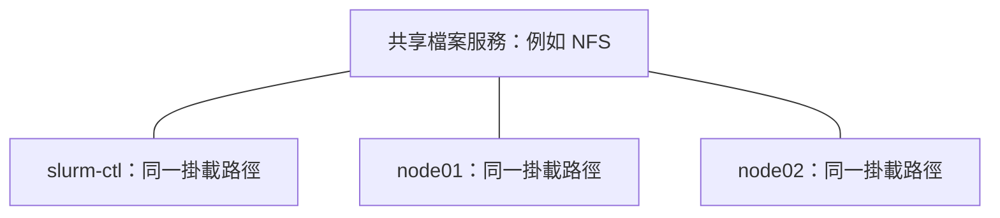

# Slurm 安裝與雙節點叢集實作

## 1. 實驗架構與角色

實驗使用三台主機：`slurm-ctl`、`node01`、`node02`，測試帳號為 `hpcuser`。



| 元件 | 職責 | 本實驗位置 |
|---|---|---|
| `slurmctld` | 維護叢集狀態、分配資源與排程作業 | `slurm-ctl` |
| `slurmd` | 接收執行要求並管理節點上的作業 | `node01`、`node02` |
| `slurmstepd` | 管理作業步驟的執行、I/O 與收尾 | 執行作業的計算節點 |
| MUNGE | 使用 `auth/munge` 時提供憑證驗證；各主機需使用一致的金鑰並維持合理時間同步 | 依實際認證設定 |
| 共享儲存 | 提供跨主機一致的檔案存取 | 尚未提供掛載驗證 |

正式環境可另設登入節點供使用者提交作業，不必讓使用者直接登入 controller。`slurmdbd`／資料庫可用於集中保存作業帳務，最小叢集未必已部署。

架構與元件參考：[Slurm 官方 Quick Start](https://slurm.schedmd.com/quickstart.html)、[slurm.conf](https://slurm.schedmd.com/slurm.conf.html)。

## 2. 安裝前準備

以下提供 **Ubuntu 24.04／發行版套件的三台 VM Lab 路徑**，使用 `/etc/slurm/slurm.conf` 與 `auth/munge`。Ubuntu／Debian 的其他版本可能使用不同範本路徑或套件選項，先用 `dpkg -L`、`systemctl cat` 與本機 man page 核對。這些是補齊的安裝步驟，並非逐條重現已驗證的歷史安裝紀錄。

SchedMD 的正式部署文件建議自行建立官方 DEB／RPM 套件；發行版 repository 中的 Slurm 套件不是由 SchedMD 維護。這裡採用 `apt` 是方便重做 VM Lab，正式環境應依[官方管理員快速入門](https://slurm.schedmd.com/quickstart_admin.html)選擇安裝方式。

| 主機 | 角色 | 安裝後需啟動的服務 |
|---|---|---|
| `slurm-ctl` | Controller；本例也用來提交作業 | `munge`、`slurmctld` |
| `node01` | Compute node | `munge`、`slurmd` |
| `node02` | Compute node | `munge`、`slurmd` |

### 2.1 固定主機名與位址

分別在對應 VM 執行：

```bash
# slurm-ctl
sudo hostnamectl set-hostname slurm-ctl

# node01
sudo hostnamectl set-hostname node01

# node02
sudo hostnamectl set-hostname node02
```

三台主機都確認：

```bash
hostname -s
hostname -I
cat /etc/os-release
timedatectl status
```

三台位址為 controller `192.168.139.46`、node01 `192.168.139.118`、node02 `192.168.139.128`。讓三台主機都能透過 DNS 或 `/etc/hosts` 解析這三個名字。例如編輯 `/etc/hosts`：

```text
192.168.139.46 slurm-ctl
192.168.139.118 node01
192.168.139.128 node02
```

以上是本 Lab 的實際 IP；重建其他環境時替換成自己的位址。確認 VM 網路可互通後再繼續：

```bash
getent hosts slurm-ctl node01 node02
```

後續的 `ssh`／`scp` 都使用 `hpcuser@IP`。先以管理者建立 `hpcuser`、設定登入密碼或 SSH key，並讓這個 Lab 帳號具有 `sudo` 權限；此後登入各 VM 執行設定都使用 `hpcuser`。

### 登入方式

帳號準備完成、node 的 SSH 服務已啟動後，從 controller 的 `hpcuser` terminal 直接使用：

```bash
# node01
ssh hpcuser@192.168.139.118

# node02
ssh hpcuser@192.168.139.128
```

登入後以 `sudo` 執行該節點的安裝與設定指令，完成一台後用 `exit` 回到 controller，再處理另一台。三台帳號的準備步驟需先在各 VM 的主控台以既有管理者執行。

### 2.2 統一使用者 UID／GID 與時間

`hpcuser` 的使用者名稱相同還不夠，三台主機的 UID/GID 也需一致；`SlurmUser=slurm` 對應的帳號同樣需存在。先查：

```bash
getent passwd hpcuser
getent group hpcuser
id hpcuser
```

新建 VM 且 UID/GID `2000` 均未占用時，可在三台主機建立一致帳號：

```bash
sudo groupadd --gid 2000 hpcuser
sudo useradd --uid 2000 --gid 2000 --create-home --shell /bin/bash hpcuser
sudo passwd hpcuser
sudo usermod -aG sudo hpcuser
```

若帳號已存在，直接核對，不要重複建立或任意更換既有 UID。上面的 sudo 群組設定供這個 Lab 的管理操作使用；重新登入 `hpcuser` 後，用 `sudo -v` 確認權限。使用現有 NTP 服務保持三台時間同步；MUNGE 憑證有時效，時鐘偏差可能造成驗證失敗。

## 3. 按角色安裝套件

### Controller：slurm-ctl

```bash
sudo apt update
sudo apt install -y munge slurmctld slurm-client openssh-client netcat-openbsd
```

### Compute nodes：node01、node02

在兩台 node 各自執行：

```bash
sudo apt update
sudo apt install -y munge slurmd slurm-client openssh-server netcat-openbsd
sudo systemctl enable --now ssh
```

套件安裝後先核對三台的 Slurm 版本與服務定義：

```bash
srun --version
getent passwd slurm
getent group slurm
systemctl cat munge
```

Controller 查看 `systemctl cat slurmctld`；compute nodes 查看 `systemctl cat slurmd`。安裝套件可能嘗試啟動服務，設定檔尚未就緒時失敗需先看日誌，不代表套件沒裝好。以下以新建 Lab 為前提，在配置期間先停止對應 Slurm 服務。

```bash
# Controller
sudo systemctl stop slurmctld

# node01、node02
sudo systemctl stop slurmd
```

## 4. 設定 MUNGE 認證

### 4.1 Controller 保留或建立一把叢集金鑰

先確認套件是否已建立金鑰：

```bash
sudo test -s /etc/munge/munge.key
```

回傳成功表示金鑰已存在，可以使用它。若不存在且本機提供 `mungekey`，才建立：

```bash
sudo -u munge /usr/sbin/mungekey --verbose
```

若套件版本沒有這個指令，依其本機文件建立金鑰；不要在每台主機分別產生不同金鑰。Controller 上確認權限並啟動：

```bash
sudo chown munge:munge /etc/munge/munge.key
sudo chmod 600 /etc/munge/munge.key
sudo systemctl enable --now munge
sudo systemctl restart munge
munge -n | unmunge
```

本機 encode/decode 應顯示 `STATUS: Success (0)`。金鑰內容不需輸出到終端或筆記。

### 4.2 將同一把金鑰安全傳給兩台 node

透過已授權的 SSH／管理通道，把 controller 的 `/etc/munge/munge.key` 放到兩台 node 的相同路徑。使用本例的 `hpcuser` 管理帳號時，可先建立只有管理者能讀的暫存檔，再傳送：

```bash
# Controller；以 hpcuser 登入 controller 後操作
sudo install -m 600 -o hpcuser -g hpcuser \
  /etc/munge/munge.key "$HOME/munge.key.transfer"
scp "$HOME/munge.key.transfer" hpcuser@192.168.139.118:munge.key.transfer
scp "$HOME/munge.key.transfer" hpcuser@192.168.139.128:munge.key.transfer
```

在 node01、node02 分別以 `hpcuser` 登入後執行：

```bash
sudo systemctl stop munge
sudo install -o munge -g munge -m 600 \
  "$HOME/munge.key.transfer" /etc/munge/munge.key
rm "$HOME/munge.key.transfer"
sudo systemctl enable --now munge
munge -n | unmunge
```

Controller 完成傳送後也刪除自己的暫存檔：

```bash
rm "$HOME/munge.key.transfer"
```

最後以三台都有的 `hpcuser` 驗證跨節點 decode；需已設定這個帳號的 SSH 登入方式：

```bash
sudo -iu hpcuser
munge -n | ssh hpcuser@192.168.139.118 unmunge
munge -n | ssh hpcuser@192.168.139.128 unmunge
```

若出現 `Invalid credential`，核對金鑰與服務是否已載入新金鑰；`Expired credential`／`Rewound credential` 則核對時間。MUNGE 操作參考：[官方 Installation Guide](https://github.com/dun/munge/wiki/Installation-Guide)。

## 5. 複製範本並建立 slurm.conf

以下以 `hpcuser` 在 controller 操作。

### 5.1 找到 /usr/share 下的範本

```bash
dpkg -L slurmctld | grep 'slurm.conf.simple'
sudo install -d -m 755 /etc/slurm
```

Ubuntu 24.04 的套件檔案清單包含 `/usr/share/doc/slurmctld/examples/slurm.conf.simple`。若實際檔案存在，且新 Lab 尚無設定檔，就用 `cp` 複製：

```bash
sudo cp /usr/share/doc/slurmctld/examples/slurm.conf.simple \
  /etc/slurm/slurm.conf
```

這步把套件提供的範例變成 Slurm 要讀取的設定檔；**範例中的 controller 與 node 資源仍需修改，不能直接啟動使用**。已有設定時先備份，避免覆蓋：

```bash
sudo cp /etc/slurm/slurm.conf /etc/slurm/slurm.conf.bak
```

若 `dpkg -L` 找到的是 `.gz`，則使用查到的實際路徑，例如：

```bash
gzip -dc /usr/share/doc/slurmctld/examples/slurm.conf.simple.gz \
  | sudo tee /etc/slurm/slurm.conf >/dev/null
```

未附範本的安裝方式可使用官方 [Slurm Configuration Tool](https://slurm.schedmd.com/configurator.html) 產生，再保存為安裝版本所使用的 `slurm.conf` 路徑。

範本位置參考：[Ubuntu 24.04 slurmctld 套件檔案清單](https://packages.ubuntu.com/noble/amd64/slurmctld/filelist)。

### 5.2 先查每台 node 的資源

在 node01、node02 各自執行：

```bash
slurmd -C
```

記下 `CPUs`、`SocketsPerBoard`、`CoresPerSocket`、`ThreadsPerCore`、`RealMemory` 等資訊，使用與 VM 相符的 CPU topology。記憶體可保留一些空間給作業系統，不能超過節點實際可用量。

### 5.3 編輯最小 Lab 設定

```bash
sudo nano /etc/slurm/slurm.conf
```

以下示例假設 **兩台 node 都是單 vCPU，且至少有 1 GiB 記憶體**。使用前必須依前一步結果修改節點欄位；`RealMemory=1024` 是示例限制值，不是本案例兩台 node 的測量結果。

```ini
ClusterName=slurm-lab
SlurmctldHost=slurm-ctl(192.168.139.46)
SlurmUser=slurm
AuthType=auth/munge

SlurmctldPort=6817
SlurmdPort=6818
StateSaveLocation=/var/spool/slurmctld
SlurmdSpoolDir=/var/spool/slurmd
SlurmctldLogFile=/var/log/slurm/slurmctld.log
SlurmdLogFile=/var/log/slurm/slurmd.log

SchedulerType=sched/backfill
SelectType=select/cons_tres
SelectTypeParameters=CR_Core_Memory
ProctrackType=proctrack/linuxproc
TaskPlugin=task/none

NodeName=node01 NodeAddr=192.168.139.118 CPUs=1 Sockets=1 CoresPerSocket=1 ThreadsPerCore=1 RealMemory=1024 State=UNKNOWN
NodeName=node02 NodeAddr=192.168.139.128 CPUs=1 Sockets=1 CoresPerSocket=1 ThreadsPerCore=1 RealMemory=1024 State=UNKNOWN
PartitionName=debug Nodes=node[01-02] Default=YES MaxTime=INFINITE State=UP
```

`slurm-ctl(192.168.139.46)` 明確指定 controller 的通訊 IP；兩台 node 也由各自的 `NodeAddr` 直接指定通訊 IP。`/etc/hosts` 的名字仍可用於人工檢查與其他服務，但下方 SSH／SCP 範例直接使用 IP。CPU topology 與記憶體不一致可能使 node 無法正常註冊。

這個最小範例使用 `task/none` 與 `proctrack/linuxproc`，沒有提供以 cgroup 強制限制作業資源的隔離。進一步啟用 `task/cgroup`／`proctrack/cgroup` 時，需依安裝版本及 cgroup v1/v2 環境另配 `cgroup.conf`，不能只改一個欄位就視為完成。

### 5.4 複製同一份設定到 node01、node02

以 `hpcuser` 在 controller 執行：

```bash
scp /etc/slurm/slurm.conf hpcuser@192.168.139.118:slurm.conf.transfer
scp /etc/slurm/slurm.conf hpcuser@192.168.139.128:slurm.conf.transfer
```

在 node01、node02 分別執行：

```bash
sudo install -d -m 755 /etc/slurm
sudo install -o root -g root -m 644 \
  "$HOME/slurm.conf.transfer" /etc/slurm/slurm.conf
rm "$HOME/slurm.conf.transfer"
```

也確認 controller 上設定檔可被一般 Slurm client 讀取：

```bash
sudo chown root:root /etc/slurm/slurm.conf
sudo chmod 644 /etc/slurm/slurm.conf
```

### 5.5 建立狀態、暫存與日誌目錄

Controller：

```bash
sudo install -d -o slurm -g slurm -m 755 /var/spool/slurmctld
sudo install -d -o slurm -g slurm -m 755 /var/log/slurm
```

node01、node02：

```bash
sudo install -d -o root -g root -m 755 /var/spool/slurmd
sudo install -d -o slurm -g slurm -m 755 /var/log/slurm
```

這些路徑需與 `slurm.conf` 一致。若已安裝服務 unit 指定額外的 RuntimeDirectory／PID 路徑，也依 `systemctl cat` 的實際定義核對，不要隨意複製其他版本的 PID 設定。

## 6. 啟動服務並驗證註冊

先確保三台的 MUNGE 都正常，再啟動 Slurm。

Controller：

```bash
sudo systemctl enable --now slurmctld
systemctl status slurmctld --no-pager
sudo journalctl -u slurmctld -n 50 --no-pager
```

node01、node02 分別執行：

```bash
sudo systemctl enable --now slurmd
systemctl status slurmd --no-pager
sudo journalctl -u slurmd -n 50 --no-pager
```

在 controller 確認：

```bash
scontrol ping
sinfo
scontrol show node node01
scontrol show node node02
```

若 node 顯示 `DOWN`、`DRAIN` 或註冊錯誤，先查 `Reason` 與對應日誌，確認名稱解析、通訊、MUNGE、CPU topology 和記憶體。排除原因後才由管理員決定是否恢復節點狀態。

最後以 `hpcuser` 執行雙節點測試：

```bash
sudo -iu hpcuser
srun -N2 -n2 --ntasks-per-node=1 hostname
```

應得到 `node01`、`node02` 各一行。輸出順序可不同；接著再執行下方的 batch job，驗證工作目錄與輸出檔行為。

## 7. Node、Partition、Job、Step、Task

- **Node**：可分配的計算主機，例如 `node01`。
- **Partition**：節點的邏輯群組，可設定允許使用者、時間上限等；本實驗使用 `debug`，名稱本身不代表特殊功能。
- **Job**：一次作業與其資源配置，有獨立 Job ID。
- **Job step**：在既有作業資源內啟動的一次執行階段，常由 `srun` 建立。
- **Task**：執行程序；多個 task 不會自動讓任意程式具有跨節點協同能力。

`--nodes=2` 是要求兩個節點，`--ntasks=2` 是要求兩個 task；CPU/task 另由 `--cpus-per-task` 指定。申請兩個節點，也不會讓 batch script 自動各執行一份；通常需在 script 內用 `srun` 啟動多個 task。

## 8. 先確認叢集，再執行雙節點測試

在 `slurm-ctl`，以 `hpcuser` 執行：

```bash
sinfo
squeue
scontrol show node
scontrol show partition debug
srun -N2 -n2 --ntasks-per-node=1 hostname
```

| 指令 | 看什麼 |
|---|---|
| `sinfo` | Partition、節點數與 `idle`／`alloc`／`down` 等節點狀態 |
| `squeue` | 目前作業、執行節點與等待原因 |
| `scontrol show node` | CPU、記憶體、節點狀態與 Reason |
| `scontrol show job JOB_ID` | 作業狀態、資源、工作目錄與輸出路徑 |

本次實驗成功執行的是 `srun -N2 -n2 hostname`，輸出：

```text
node02
node01
```

順序可能改變；`node02`、`node01` 是輸出，不是接在 `hostname` 後面的參數。上面的複習指令增加 `--ntasks-per-node=1`，讓一節點一 task 的意圖更清楚。

這個結果支持「當時可在兩個節點啟動 task 並回傳結果」，不能據此宣稱共享儲存、帳務系統或所有工作負載都已正常。

## 9. 第一個 batch job

在 `hpcuser` 的工作目錄建立 `hello.sh`：

```bash
cat > hello.sh <<'EOF_SCRIPT'
#!/bin/bash
#SBATCH --job-name=hello
#SBATCH --nodes=1
#SBATCH --ntasks=1
#SBATCH --time=00:01:00
#SBATCH --output=hello-%j.out

echo "Job ID: $SLURM_JOB_ID"
echo "Node: $(hostname)"
echo "WorkDir: $(pwd)"
sleep 10
echo "Done"
EOF_SCRIPT

sbatch hello.sh
squeue
```

`%j` 會替換成 Job ID。本次實驗回傳 `Submitted batch job 6`，並顯示：

```text
JOBID PARTITION NAME  USER    ST TIME NODES NODELIST(REASON)
6     debug     hello hpcuser R  0:04 1     node01
```

| ST | 意義 |
|---|---|
| `PD` | Pending，等待資源或其他條件；查看 Reason |
| `R` | Running，作業正在執行 |
| `CG` | Completing，作業正在收尾，部分程序可能仍在執行 |
| `CD` | Completed，作業正常結束 |
| `F` | Failed，非零退出碼或其他失敗條件 |

`sbatch` 成功只表示作業已提交；從預設 `squeue` 消失也不等於成功。若叢集有可用的 accounting 紀錄，可查：

```bash
sacct -j 6 --format=JobID,JobName,State,ExitCode,NodeList
```

小型 Lab 若尚未設定 accounting，可能查不到歷史紀錄。作業尚在 controller 保留期間時，也可用 `scontrol show job 6`，並搭配輸出與服務日誌確認。

參考：[sbatch 官方文件](https://slurm.schedmd.com/sbatch.html)、[squeue 狀態碼](https://slurm.schedmd.com/squeue.html#SECTION_JOB-STATE-CODES)、[sacct 官方文件](https://slurm.schedmd.com/sacct.html)。

## 10. Controller 為什麼找不到 hello-6.out？

Slurm 會傳送 batch script，但不會因此自動同步使用者的程式、輸入資料或產生的檔案。標準輸出由執行 batch 的節點寫入；未指定 `--chdir` 時，工作目錄預設沿用提交時的目錄。

假設從 `/home/hpcuser` 提交、作業在 `node01` 執行，且使用相對輸出路徑 `hello-%j.out`，要查的是 **node01 上的 `/home/hpcuser/hello-6.out`**。三台主機即使都有同名路徑，也可能各自存放不同資料。

> [!important] 實驗結果的確認範圍
> 已確認 job 6 曾在 node01 顯示為 Running，以及 controller 找不到輸出檔。實驗紀錄尚未提供 node01 上的輸出內容、掛載資訊或最終退出碼，所以「沒有共享儲存」是待查證的原因；也需檢查工作目錄、權限與作業是否成功啟動。

### 確認步驟

作業仍可查詢時，先在 controller 執行：

```bash
scontrol show job 6
```

核對 `JobState`、`BatchHost`／`NodeList`、`WorkDir`、`StdOut`、`StdErr`。再依查到的節點與路徑檢查；以下沿用本案例：

```bash
ssh hpcuser@192.168.139.118 'ls -ld /home/hpcuser; ls -l /home/hpcuser/hello-6.out'
ssh hpcuser@192.168.139.118 'cat /home/hpcuser/hello-6.out'
findmnt -T /home/hpcuser
ssh hpcuser@192.168.139.118 'findmnt -T /home/hpcuser'
```

SSH 是此處的人工檢查工具，不代表 Slurm 必須靠使用者 SSH 登入才能執行作業。若輸出不存在，查看 node01 日誌，尋找切換工作目錄、建立輸出檔或啟動程序的錯誤：

```bash
sudo journalctl -u slurmd -n 100 --no-pager
```

若確認檔案只在 node01，可先取回單一結果：

```bash
scp hpcuser@192.168.139.118:/home/hpcuser/hello-6.out .
```

注意 `cat hello-*.out` 才會展開萬用字元；`cat 'hello-*.out'` 或 `cat hello-\*.out` 會尋找字面上的星號檔名。已知 Job ID 時直接使用 `cat hello-6.out` 更明確。

輸出與檔案傳送行為參考：[sbatch 官方說明](https://slurm.schedmd.com/sbatch.html)。

## 11. Slurm 與共享儲存的關係



若三台都把同一個 export 掛載到 `/shared`，node01 寫入 `/shared/hello-6.out` 後，controller 才能透過該掛載看到同一份檔案。目錄必須存在、掛載成功，且 `hpcuser` 的 UID/GID 與權限設定須一致。

確認共享目錄可讀寫後，才可改成：

```bash
sbatch --chdir=/shared --output=/shared/hello-%j.out hello.sh
```

指定絕對路徑只決定寫在哪裡，不會建立共享儲存。若架構題出現 NetApp Storage，應再確認它提供的是 NFS 等檔案服務，還是區塊儲存；設備名稱本身不足以證明各節點正在使用同一個共享目錄。

## 12. Controller 名稱解析失敗的案例

本次實驗 node01 的日誌曾出現：

```text
getaddrinfo(slurm-ctl:6817) failed: Name or service not known
slurm_set_addr: Unable to resolve "slurm-ctl"
Unable to register: Unable to contact slurm controller (connect failure)
```

這是名稱解析失敗的直接證據。若設定只寫 `SlurmctldHost=slurm-ctl`，可先在計算節點檢查：

```bash
getent hosts slurm-ctl
nc -vz slurm-ctl 6817
```

`6817` 是預設 controller port；若設定不同，使用實際值。名稱解析成功與 TCP 可連線是不同檢查，TCP 成功也不等於 Slurm 認證成功。

### 兩種設定方式

1. 使用 DNS 或在需要解析名稱的主機設定 `/etc/hosts`。
2. 在 `slurm.conf` 明確指定 controller 主機名與通訊 IP。

本次實驗確認 controller IP 為 `192.168.139.46`，提出的設定為：

```ini
SlurmctldHost=slurm-ctl(192.168.139.46)
```

括號前仍是 controller 主機名，括號內是通訊位址。這項設定解決 Slurm 找 controller 的位址問題，但不會替 SSH 或其他服務建立全系統 DNS 紀錄。

使用本地設定檔的 Lab，需讓 controller 與兩個 compute node 使用一致的相關設定，並重新載入讓變更生效；官方支援 `scontrol reconfigure`，已失聯節點可能還需要本機處理。本次實驗採取重啟服務後，再以 `srun` 驗證的路徑，但沒有提供完整修改差異，不能把後續成功全部歸因於單一設定。

設定語法參考：[slurm.conf — SlurmctldHost](https://slurm.schedmd.com/slurm.conf.html#OPT_SlurmctldHost)。

## 13. slurmd 重啟很久、Job 卡在 CG

`CG` 只表示正在收尾，不能單靠它判定卡住的根因。當服務重啟等待很久，先查看執行節點上的狀態與日誌：

```bash
systemctl status slurmd --no-pager
journalctl -u slurmd -n 100 --no-pager
journalctl -fu slurmd
ps -ef | grep '[s]lurm'
```

controller 上同步查看：

```bash
squeue
scontrol show node node01
scontrol show job JOB_ID
sudo journalctl -u slurmctld -n 100 --no-pager
```

按證據分別處理名稱解析、網路連線、認證、工作目錄／儲存或程序收尾問題。本次實驗缺少足以證實重啟緩慢原因的日誌，因此保留為未定案。需要取消自己提交的作業時可用 `scancel JOB_ID`；不要把等待超過固定秒數當成直接強制終止 daemon 的依據。

## 14. 後續練習：觀察 Pending

這是延伸練習，尚未在本次實驗中驗證。先提交占用兩台節點的短作業，再提交另一個也需要兩台的作業：

```bash
sbatch -p debug -N2 --exclusive --time=00:03:00 \
  --output=occupy-%j.out --wrap='sleep 120'
sbatch -p debug -N2 --time=00:01:00 \
  --output=wait-%j.out --wrap='srun --ntasks=2 --ntasks-per-node=1 hostname'
squeue
```

前提是 `debug` 有兩台可用節點、允許上述時間與資源要求，且執行節點的工作目錄可用。第一個作業占用節點期間，第二個通常會等待；是否顯示 `Resources`、`Priority` 或其他原因，應以當下 `squeue` 的 Reason 為準。
