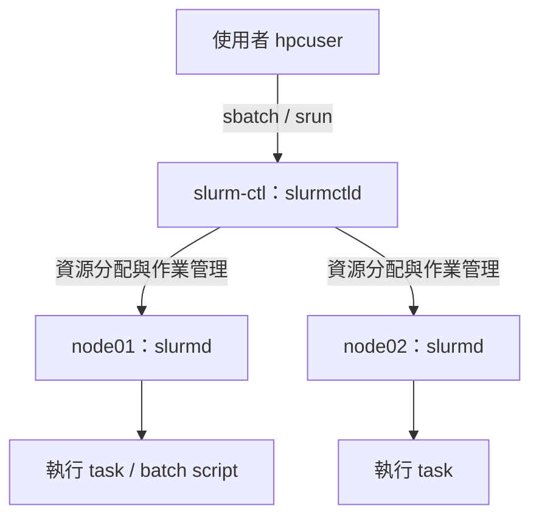
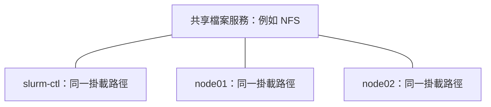

# Slurm 叢集架構與實作筆記

Slurm 是 Linux 計算叢集的資源管理與作業排程系統。使用者提出節點、CPU、記憶體與執行時間需求後，Slurm 決定何時分配資源，再在計算節點啟動作業。共享儲存則負責讓各台主機存取同一份資料，兩者需要分別設定。

回到 [[DevOps Technology Overview]] · 相關操作：[[Linux 基本觀念和指令]]、[[Linux networking 常用指令]]、[[Linux OpenSSH 設定指南]]

## 1. 實驗架構與角色

本筆記整理「丁組郵件架構解析」對話中的 Slurm 實驗；已知主機為 `slurm-ctl`、`node01`、`node02`，測試帳號為 `hpcuser`。這份紀錄聚焦架構、操作與排錯，不是已驗證的完整安裝程序。



| 元件 | 職責 | 本實驗位置 |
|---|---|---|
| `slurmctld` | 維護叢集狀態、分配資源與排程作業 | `slurm-ctl` |
| `slurmd` | 接收執行要求並管理節點上的作業 | `node01`、`node02` |
| `slurmstepd` | 管理作業步驟的執行、I/O 與收尾 | 執行作業的計算節點 |
| MUNGE | 使用 `auth/munge` 時提供憑證驗證；各主機需使用一致的金鑰並維持合理時間同步 | 依實際認證設定 |
| 共享儲存 | 提供跨主機一致的檔案存取 | 對話未提供掛載驗證 |

正式環境可另設登入節點供使用者提交作業，不必讓使用者直接登入 controller。`slurmdbd`／資料庫可用於集中保存作業帳務，最小叢集未必已部署。

架構與元件參考：[Slurm 官方 Quick Start](https://slurm.schedmd.com/quickstart.html)、[slurm.conf](https://slurm.schedmd.com/slurm.conf.html)。

## 2. Node、Partition、Job、Step、Task

- **Node**：可分配的計算主機，例如 `node01`。
- **Partition**：節點的邏輯群組，可設定允許使用者、時間上限等；本實驗使用 `debug`，名稱本身不代表特殊功能。
- **Job**：一次作業與其資源配置，有獨立 Job ID。
- **Job step**：在既有作業資源內啟動的一次執行階段，常由 `srun` 建立。
- **Task**：執行程序；多個 task 不會自動讓任意程式具有跨節點協同能力。

`--nodes=2` 是要求兩個節點，`--ntasks=2` 是要求兩個 task；CPU/task 另由 `--cpus-per-task` 指定。申請兩個節點，也不會讓 batch script 自動各執行一份；通常需在 script 內用 `srun` 啟動多個 task。

## 3. 先確認叢集，再執行雙節點測試

在 `slurm-ctl`，以 `hpcuser` 執行：

```bash
sinfo
squeue
scontrol show node
scontrol show partition debug
srun -N2 -n2 --ntasks-per-node=1 hostname
```

| 指令 | 看什麼 |
|---|---|
| `sinfo` | Partition、節點數與 `idle`／`alloc`／`down` 等節點狀態 |
| `squeue` | 目前作業、執行節點與等待原因 |
| `scontrol show node` | CPU、記憶體、節點狀態與 Reason |
| `scontrol show job JOB_ID` | 作業狀態、資源、工作目錄與輸出路徑 |

原對話成功執行的是 `srun -N2 -n2 hostname`，輸出：

```text
node02
node01
```

順序可能改變；`node02`、`node01` 是輸出，不是接在 `hostname` 後面的參數。上面的複習指令增加 `--ntasks-per-node=1`，讓一節點一 task 的意圖更清楚。

這個結果支持「當時可在兩個節點啟動 task 並回傳結果」，不能據此宣稱共享儲存、帳務系統或所有工作負載都已正常。

## 4. 第一個 batch job

在 `hpcuser` 的工作目錄建立 `hello.sh`：

```bash
cat > hello.sh <<'EOF_SCRIPT'
#!/bin/bash
#SBATCH --job-name=hello
#SBATCH --nodes=1
#SBATCH --ntasks=1
#SBATCH --time=00:01:00
#SBATCH --output=hello-%j.out

echo "Job ID: $SLURM_JOB_ID"
echo "Node: $(hostname)"
echo "WorkDir: $(pwd)"
sleep 10
echo "Done"
EOF_SCRIPT

sbatch hello.sh
squeue
```

`%j` 會替換成 Job ID。原對話回傳 `Submitted batch job 6`，並顯示：

```text
JOBID PARTITION NAME  USER    ST TIME NODES NODELIST(REASON)
6     debug     hello hpcuser R  0:04 1     node01
```

| ST | 意義 |
|---|---|
| `PD` | Pending，等待資源或其他條件；查看 Reason |
| `R` | Running，作業正在執行 |
| `CG` | Completing，作業正在收尾，部分程序可能仍在執行 |
| `CD` | Completed，作業正常結束 |
| `F` | Failed，非零退出碼或其他失敗條件 |

`sbatch` 成功只表示作業已提交；從預設 `squeue` 消失也不等於成功。若叢集有可用的 accounting 紀錄，可查：

```bash
sacct -j 6 --format=JobID,JobName,State,ExitCode,NodeList
```

小型 Lab 若尚未設定 accounting，可能查不到歷史紀錄。作業尚在 controller 保留期間時，也可用 `scontrol show job 6`，並搭配輸出與服務日誌確認。

參考：[sbatch 官方文件](https://slurm.schedmd.com/sbatch.html)、[squeue 狀態碼](https://slurm.schedmd.com/squeue.html#SECTION_JOB-STATE-CODES)、[sacct 官方文件](https://slurm.schedmd.com/sacct.html)。

## 5. Controller 為什麼找不到 hello-6.out？

Slurm 會傳送 batch script，但不會因此自動同步使用者的程式、輸入資料或產生的檔案。標準輸出由執行 batch 的節點寫入；未指定 `--chdir` 時，工作目錄預設沿用提交時的目錄。

假設從 `/home/hpcuser` 提交、作業在 `node01` 執行，且使用相對輸出路徑 `hello-%j.out`，要查的是 **node01 上的 `/home/hpcuser/hello-6.out`**。三台主機即使都有同名路徑，也可能各自存放不同資料。

> [!important] 對話中的證據邊界
> 已確認 job 6 曾在 node01 顯示為 Running，以及 controller 找不到輸出檔。對話尚未提供 node01 上的輸出內容、掛載資訊或最終退出碼，所以「沒有共享儲存」是待查證的原因；也需檢查工作目錄、權限與作業是否成功啟動。

### 確認步驟

作業仍可查詢時，先在 controller 執行：

```bash
scontrol show job 6
```

核對 `JobState`、`BatchHost`／`NodeList`、`WorkDir`、`StdOut`、`StdErr`。再依查到的節點與路徑檢查；以下沿用本案例：

```bash
ssh hpcuser@node01 'ls -ld /home/hpcuser; ls -l /home/hpcuser/hello-6.out'
ssh hpcuser@node01 'cat /home/hpcuser/hello-6.out'
findmnt -T /home/hpcuser
ssh hpcuser@node01 'findmnt -T /home/hpcuser'
```

SSH 是此處的人工檢查工具，不代表 Slurm 必須靠使用者 SSH 登入才能執行作業。若輸出不存在，查看 node01 日誌，尋找切換工作目錄、建立輸出檔或啟動程序的錯誤：

```bash
sudo journalctl -u slurmd -n 100 --no-pager
```

若確認檔案只在 node01，可先取回單一結果：

```bash
scp hpcuser@node01:/home/hpcuser/hello-6.out .
```

注意 `cat hello-*.out` 才會展開萬用字元；`cat 'hello-*.out'` 或 `cat hello-\*.out` 會尋找字面上的星號檔名。已知 Job ID 時直接使用 `cat hello-6.out` 更明確。

輸出與檔案傳送行為參考：[sbatch 官方說明](https://slurm.schedmd.com/sbatch.html)。

## 6. Slurm 與共享儲存的關係



若三台都把同一個 export 掛載到 `/shared`，node01 寫入 `/shared/hello-6.out` 後，controller 才能透過該掛載看到同一份檔案。目錄必須存在、掛載成功，且 `hpcuser` 的 UID/GID 與權限設定須一致。

確認共享目錄可讀寫後，才可改成：

```bash
sbatch --chdir=/shared --output=/shared/hello-%j.out hello.sh
```

指定絕對路徑只決定寫在哪裡，不會建立共享儲存。若架構題出現 NetApp Storage，應再確認它提供的是 NFS 等檔案服務，還是區塊儲存；設備名稱本身不足以證明各節點正在使用同一個共享目錄。

## 7. Controller 名稱解析失敗的案例

原對話 node01 的日誌曾出現：

```text
getaddrinfo(slurm-ctl:6817) failed: Name or service not known
slurm_set_addr: Unable to resolve "slurm-ctl"
Unable to register: Unable to contact slurm controller (connect failure)
```

這是名稱解析失敗的直接證據。若設定只寫 `SlurmctldHost=slurm-ctl`，可先在計算節點檢查：

```bash
getent hosts slurm-ctl
nc -vz slurm-ctl 6817
```

`6817` 是預設 controller port；若設定不同，使用實際值。名稱解析成功與 TCP 可連線是不同檢查，TCP 成功也不等於 Slurm 認證成功。

### 兩種設定方式

1. 使用 DNS 或在需要解析名稱的主機設定 `/etc/hosts`。
2. 在 `slurm.conf` 明確指定 controller 主機名與通訊 IP。

原對話確認 controller IP 為 `192.168.139.46`，提出的設定為：

```ini
SlurmctldHost=slurm-ctl(192.168.139.46)
```

括號前仍是 controller 主機名，括號內是通訊位址。這項設定解決 Slurm 找 controller 的位址問題，但不會替 SSH 或其他服務建立全系統 DNS 紀錄。

使用本地設定檔的 Lab，需讓 controller 與兩個 compute node 使用一致的相關設定，並重新載入讓變更生效；官方支援 `scontrol reconfigure`，已失聯節點可能還需要本機處理。原對話採取重啟服務後，再以 `srun` 驗證的路徑，但沒有提供完整修改差異，不能把後續成功全部歸因於單一設定。

設定語法參考：[slurm.conf — SlurmctldHost](https://slurm.schedmd.com/slurm.conf.html#OPT_SlurmctldHost)。

## 8. slurmd 重啟很久、Job 卡在 CG

`CG` 只表示正在收尾，不能單靠它判定卡住的根因。當服務重啟等待很久，先查看執行節點上的狀態與日誌：

```bash
systemctl status slurmd --no-pager
journalctl -u slurmd -n 100 --no-pager
journalctl -fu slurmd
ps -ef | grep '[s]lurm'
```

controller 上同步查看：

```bash
squeue
scontrol show node node01
scontrol show job JOB_ID
sudo journalctl -u slurmctld -n 100 --no-pager
```

按證據分別處理名稱解析、網路連線、認證、工作目錄／儲存或程序收尾問題。原對話缺少足以證實重啟緩慢原因的日誌，因此保留為未定案。需要取消自己提交的作業時可用 `scancel JOB_ID`；不要把等待超過固定秒數當成直接強制終止 daemon 的依據。

## 9. 後續練習：觀察 Pending

這是延伸練習，尚未在原對話中驗證。先提交占用兩台節點的短作業，再提交另一個也需要兩台的作業：

```bash
sbatch -p debug -N2 --exclusive --time=00:03:00 \
  --output=occupy-%j.out --wrap='sleep 120'
sbatch -p debug -N2 --time=00:01:00 \
  --output=wait-%j.out --wrap='srun --ntasks=2 --ntasks-per-node=1 hostname'
squeue
```

前提是 `debug` 有兩台可用節點、允許上述時間與資源要求，且執行節點的工作目錄可用。第一個作業占用節點期間，第二個通常會等待；是否顯示 `Resources`、`Priority` 或其他原因，應以當下 `squeue` 的 Reason 為準。

## 來源與驗證範圍

- [Slurm 官方管理員快速入門（Quick Start Administrator Guide）](https://slurm.schedmd.com/quickstart_admin.html)：叢集安裝、設定與管理的入門參考。
- [原始對話：丁組郵件架構解析](chatgpt-conversation://6abd4b82-6454-83ee-b5ed-bd00d5d7920e)：使用者提供的實驗輸出與近期對話紀錄；本筆記僅整理其中 Slurm 段落。
- 官方文件查閱日期：2026-10-01；各節的連結提供架構、指令與設定依據，實際指令選項仍應配合已安裝版本。
- 已有實驗證據：controller 名稱解析錯誤、雙節點 hostname 測試成功、job 6 曾在 node01 執行、controller 找不到輸出檔。
- 尚未確認：job 6 最終退出碼、node01 的輸出內容、共享儲存掛載、重啟緩慢根因與 accounting 設定。本次整理沒有重新登入叢集執行測試。
